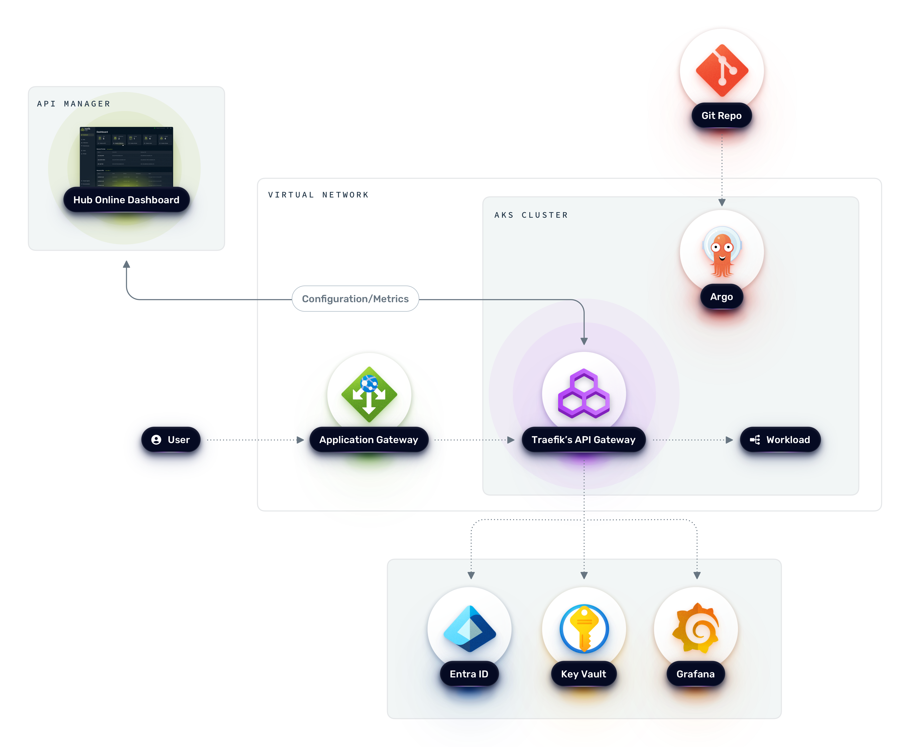

<h1 align=center>Traefik Labs Workshop</h1>

<b>Welcome to the Traefik Labs hands-on workshop!</b>

# Overview

This workshop will walk you through the journey from deploying <b>Traefik Application Proxy</b> on Azure Kubernetes Service (AKS) and how easy it is to publish your backend services to the outside world. Then, we will explore how to upgrade our existing Application Proxy instance to API Gateway and take advantage of all the enterprise-level capabilities in <b>Traefik Hub API Gateway</b> to secure access to our backend application. Finally, we will enable the API Management feature and dive into how to manage our APIs at scale with <b>Traefik Hub API Management</b>.

The hands-on lab is divided into multiple modules. Each module covers a particular topic, depending on the previous module's completion. It is essential to follow the guide as we progress through the lab.   

# Prerequisites

- Participants should have an Azure account with a valid subscription to provision the AKS cluster. 

- Kubernetes administration and networking knowledge. 

# Agenda

> [!IMPORTANT]     
> *Each module contains all manifest files for each lab.*.             
> :pencil2: *This step is required to be implemented in the LAB.*.

- [Module 0: Provision AKS cluster](module-0/readme.md)

- [Module 1: Traefik Application Proxy](module-1/readme.md)

- [Module 2: Traefik Hub API Gateway](module-2/readme.md)

- [Module 3: Traefik Hub API Management](module-3/readme.md)

- [Module 4: API Advanced Capabilities](module-4/readme.md)

------
:arrow_forward: [Module 0: Provision AKS cluster](module-0/readme.md)
