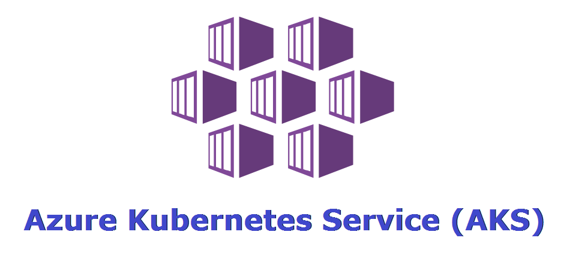

## Introduction

In this module, we will deploy an AKS cluster using AZ CLI. Traefik Hub will claim the cluster for easier management of APIs. 

#### Prerequisites

- kubectl installed on your laptop. 

<details><summary>Linux</summary>

<p>
1. Download the binary.

```bash
x86-64  
curl -LO "https://dl.k8s.io/release/$(curl -L -s https://dl.k8s.io/release/stable.txt)/bin/linux/amd64/kubectl.sha256"
```
```bash
ARM64
curl -LO "https://dl.k8s.io/release/$(curl -L -s https://dl.k8s.io/release/stable.txt)/bin/linux/arm64/kubectl.sha256"
```

2. Install kubectl

```bash
sudo install -o root -g root -m 0755 kubectl /usr/local/bin/kubectl
```

3. Verify
```bash
kubectl version --client
```
</p>
</details>

<details><summary>MacOS</summary>

<p>
1. Download the binary.

```bash
x86-64
curl -LO "https://dl.k8s.io/release/$(curl -L -s https://dl.k8s.io/release/stable.txt)/bin/darwin/amd64/kubectl"
```
```bash
ARM64
curl -LO "https://dl.k8s.io/release/$(curl -L -s https://dl.k8s.io/release/stable.txt)/bin/darwin/arm64/kubectl"
```

2. Install kubectl

```bash
chmod +x ./kubectl && sudo mv ./kubectl /usr/local/bin/kubectl && sudo chown root: /usr/local/bin/kubectl
```

3. Verify
```bash
kubectl version --client
```
</p>
</details>
<details><summary>Windows</summary>

<p>
1. Download kubectl executable file.

```bash
x86-64
curl.exe -LO "https://dl.k8s.io/release/v1.29.1/bin/windows/amd64/kubectl.exe"
```

2. Run kubectl from the same directory or add it to your environment variables. 

```bash
kubectl version --client
```

</p>
</details>
<br> 

- AZ CLI tools installed 

<details><summary>Linux</summary>

<p>
Install with one command

```bash
curl -sL https://aka.ms/InstallAzureCLIDeb | sudo bash
```
Verify

```bash
az --version
```
</p>
</details>
<details><summary>MacOS</summary>

<p>
Install with Homebrew

```bash
brew update && brew install azure-cli
```
Verify

```bash
az --version
```
</p>
</details>
<details><summary>Windows</summary>

<p>
Download and install the AZ CLI install file.

https://aka.ms/installazurecliwindowsx64
</p>
Verify

```bash
az --version
```

</p>
</details>
<br> 


#### Deploy a Kubernetes Cluster with the Azure CLI

1. Log in to your Azure account. The below command should open a new browser. Log in with your Azure credentials. 

```bash
az login
```
2. You can verify your subscription details and change subscriptions if needed using the below commands:

```bash
# View subscriptions
az account list --out table

# Verify selected subscription
az account show --out table

# Set the correct subscription (if needed)
az account set --subscription <subscription_id>

# Verify that the correct subscription is now set
az account show --out table
```

3. Define the variables we will utilize below during Kubernetes cluster creation. 

```bash
export CLUSTER_NAME=                            # example: firstName-lastName
export AKS_RESOURCE_GROUP=$CLUSTER_NAME         # example: we will use the same name for our resource group. 
export AKS_REGION=                              # example: westus, centralus, eastus. For the full list, "az account list-locations --output table"
export KUBECONFIG=                              # example: ~/.kube/$CLUSTER_NAME.yaml
```

4. Create a resource group that would hold all AKS resources associated with this cluster

```bash
az group create -n $AKS_RESOURCE_GROUP -l $AKS_REGION
```

5. Create a production-ready Kubernetes cluster using a single command

```bash
az aks create --resource-group $AKS_RESOURCE_GROUP --name  $CLUSTER_NAME --node-count 2 --ssh-key=~/.ssh/id_rsa.pub 
```

6. Retrieve AKS credentials so you can manage the cluster from your laptop.

```bash
az aks get-credentials --resource-group $AKS_RESROUCE_GROUP --name --name $CLUSTER_NAME --file $KUBECONFIG
```

7. Verify access to the AKS cluster

```bash
kubectl get nodes
```

#### References
- How to install Azure CLI
https://learn.microsoft.com/en-us/cli/azure/install-azure-cli
- How to install Kubectl
https://kubernetes.io/docs/tasks/tools/install-kubectl-linux/


</br>

------
:house: [HOME](../README.md) | :arrow_forward: [Module 1](../module-1/readme.md)
