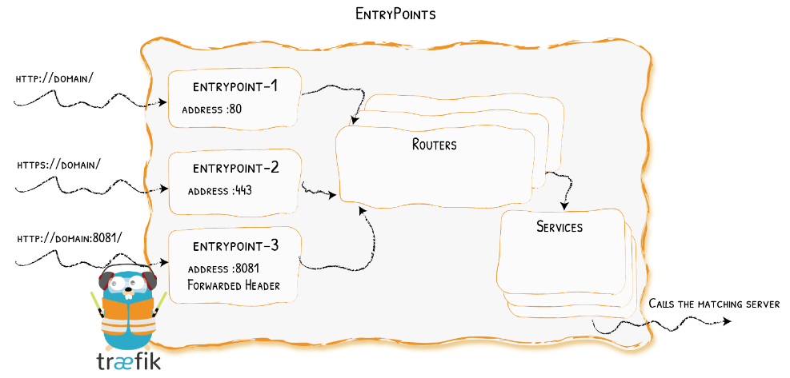
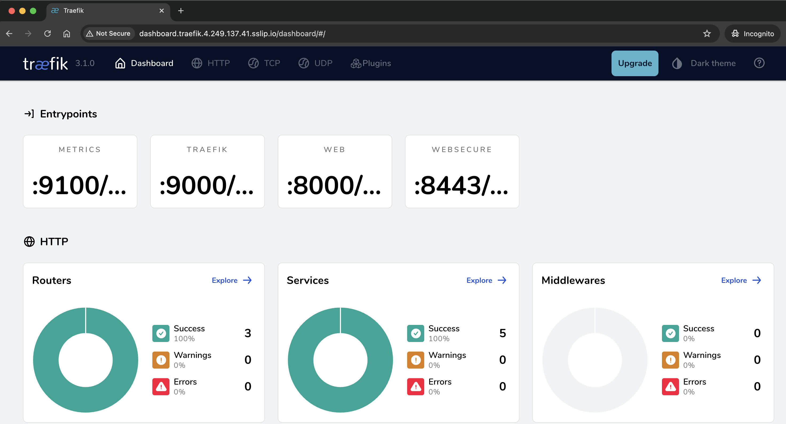
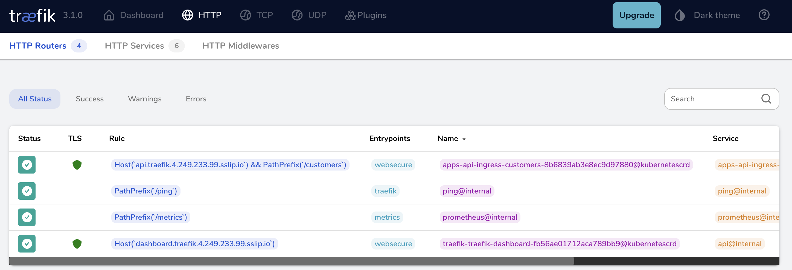
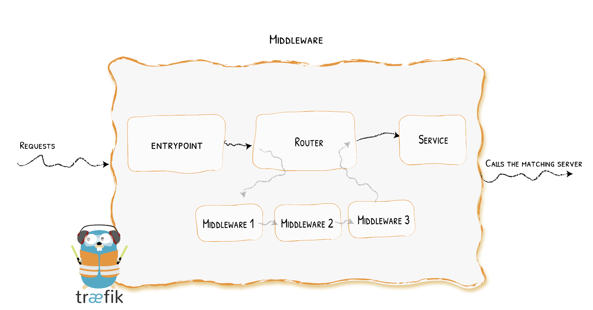
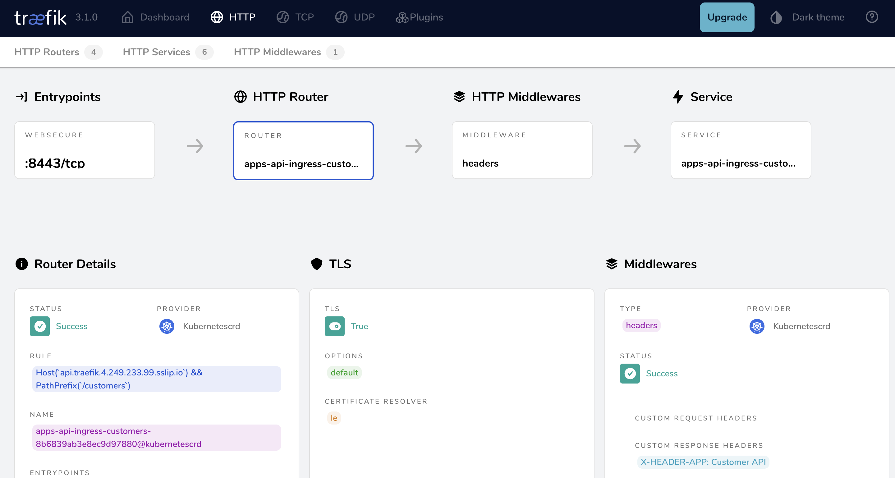

<br/>

<div align="center" style="margin: 30px;">
<a href="https://traefik.io/traefik/">
  
</a>
<br />
</div>
<div align="center">
    <a href="https://traefik.io/traefik/">Website</a> |
    <a href="https://doc.traefik.io/traefik/">Documentation</a> 
</div>

# What is Traefik Application Proxy

Traefik Application Proxy is a cloud-native, GitOps-driven, lightweight ingress controller that embraces Kubernetes architecture in its design. It allows seamless migration from Proxy to API gateway and full API management lifecycle solution without interrupting your existing services.

## Concept:

Traefik Application proxy is based on the concept of <b>EntryPoints</b>, <b>Routers</b>, <b>Middlewares</b> and <b>Services</b>. 

- <b>EntryPoints</b>: are the network entry points into Traefik. They define the port to receive the packets and whether to listen for TCP or UDP.
- <b>Routers</b>: are the bridge between the incoming requests and the backend services.
- <b>Middlewares</b>: Attached to the routers, middlewares can modify the requests or responses before they are sent to your service.
- <b>Services</b>: are responsible for configuring how to reach the application that will eventually handle the incoming requests.
<br>

        

___

## Get started with Traefik Application Proxy

> [!NOTE]     
> :pencil2: *Run below steps in your cluster.*

1. Install Traefik using helm.

    - Add the helm repository     
    ```bash
    helm repo add --force-update traefik https://traefik.github.io/charts
    ```
    - Install Traefik Application Proxy using Helm and create a new namespace.    
    ```
    helm install traefik -n traefik --create-namespace --values module-1/src/values.yaml traefik/traefik
    ```
2. Clone git repo into your client

    ```bash
    git clone <GIT-REPO-URL>
    ```

3. Update the cloned repo with your cluster External IP. We are utilizing sslip.io for DNS services. 

    ```bash
    export EXTERNAL_IP=$(kubectl get svc/traefik -n traefik --no-headers | awk {'print $4'})
    ```
    ```bash
    for i in $(grep -Rl '${EXTERNAL_IP}'); do sed -i 's/${EXTERNAL_IP}/'$EXTERNAL_IP'/g' $i; done
    ```      
4. Publish Traefik Dashboard.   

   ```bash
   kubectl apply -f module-1/src/dashboard-ingress.yaml
   ```
   Treafik uses <b>IngressRoute</b> to publish the application based on the concept of <b>EntryPoint</b>, <b>Routers</b>, <b>Middleware</b> and <b>Service</b>.  

   ```yaml
   apiVersion: traefik.io/v1alpha1
   kind: IngressRoute
   metadata:
     name: traefik-dashboard
     namespace: traefik
   spec:
     entryPoints:                                                # Network port which will receive the packet (HTTP, HTTPS, TCP,..etc). 
       - websecure
     routes:
     - match: Host(`dashboard.traefik.EXTERNAL_IP.sslip.io`)     # URL to match before routing to backend service
       kind: Rule
       services:                                                 # Backend service name and port number. 
       - name: api@internal
         kind: TraefikService
     tls:                                                        # LetsEncrypt to auto generate certificate for the application
       certResolver: le
   ```

5. Verify Access to Traefik Dashboard

    - From the broswer, navigate to the <b>Host</b> URL defined in dashboard-ingress manifest file. 

    example:
    ```bash
    http://dashboard.traefik.{EXTERNAL_IP}.sslip.io
    ```

    - We should be able to access Traefik Proxy Dashboard

        <details><summary> :bulb: Traefik Dashboard</summary> 
       

</details>
</p>


<br>

___


# Demo Application

## Overview

The demo application consists of 4 deployments (Customers, Employees, Flights, and Tickets) for a fictional company called Traefik Airlines. Each deployment is serving data based on statically defined entries purposely defined to simulate API requests. 

## Deploy the Demo application


1. Create a new namespace for the application

    ```bash
    kubectl create namespace apps
    ```

2. Deploy the demo applications that we will use throughout the lab. 

    ```bash
    kubectl apply -f module-1/apps/customers/ -f module-1/apps/employee/ -f module-1/apps/flight/ -f module-1/apps/ticket/ -f module-1/apps/external/ -f module-1/apps/whoami.yaml
    ```

   <p>
   <div align="left">
     <details><summary>Expected output</summary>
     
     <p>
     
     ```bash
     kubectl get pod,svc --namespace apps
     NAME                                   READY   STATUS    RESTARTS   AGE
     pod/customer-app-v4-795fbf45bf-cqss2   1/1     Running   0          84s
     pod/customer-app-v3-698c85568c-nsv54   1/1     Running   0          84s
     pod/employee-app-6d7656d69f-m8lnr      1/1     Running   0          84s
     pod/flight-app-8f696784f-g8qn8         1/1     Running   0          83s
     pod/customer-app-59bcb5b9bc-4z7xw      1/1     Running   0          84s
     pod/ticket-app-867959bdbd-vkwx5        1/1     Running   0          83s
     pod/customer-app-v2-5ccf4544f7-tv7lt   1/1     Running   0          84s
     pod/whoami-697f8c6cbc-qp5nw            1/1     Running   0          84s
     
     NAME                      TYPE           CLUSTER-IP      EXTERNAL-IP        PORT(S)    AGE
     service/customer-app-v2   ClusterIP      10.43.233.33    <none>             3000/TCP   84s
     service/customer-app-v3   ClusterIP      10.43.47.208    <none>             3000/TCP   84s
     service/customer-app-v4   ClusterIP      10.43.127.91    <none>             3000/TCP   84s
     service/customer-app      ClusterIP      10.43.64.46     <none>             3000/TCP   84s
     service/employee-app      ClusterIP      10.43.211.198   <none>             3000/TCP   84s
     service/flight-app        ClusterIP      10.43.174.194   <none>             3000/TCP   83s
     service/ticket-app        ClusterIP      10.43.73.169    <none>             3000/TCP   83s
     service/world-time-api    ExternalName   <none>          worldtimeapi.org   443/TCP    83s
     service/whoami            ClusterIP      10.43.142.176   <none>             80/TCP     84s
     ```
     </details>
   </p>
   </div>

## Publish demo app 
1. To publish <b>customer-app</b> as an example to the outside world, we need to apply an ingress definition that will instruct traefik to route the incoming request to the backend service.      

    ```yaml
    ---
    apiVersion: traefik.io/v1alpha1
    kind: IngressRoute
    metadata:
      name: api-ingress-customers
      namespace: apps                                                                     # Namespace where the application is deployed. 
    spec:
      entryPoints:
        - websecure                                                                       # Request is coming on HTTPS (port 443).
      routes:
        - kind: Rule
          match: Host(`api.traefik.EXTERNAL_IP.sslip.io`) && PathPrefix(`/customers`)     # Traefik will be monitoring for this specific URL.
          services:
            - name: customer-app                                                          # The request routed to customer-app service on port 3000.
              port: 3000
      tls:
        certResolver: le
    ```
   Lets apply the IngressRoute definition. 
    ```bash
    kubectl apply -f module-1/apps/customers/ingress/customer-ingress.yaml
    ```
2. Traefik Dashboard will list the newly created route.

    

3. Verify connectivity to the customer-app API. 

    ```bash
     $curl https://api.traefik.EXTERNAL_IP.sslip.io/customers

      {
        "customers": [
          { "id": 1, "firstName": "John", "lastName": "Doe", "points": 100, "status": "bronze" },
          { "id": 2, "firstName": "Jane", "lastName": "Doe", "points": 200, "status": "silver" },
          { "id": 3, "firstName": "John", "lastName": "Smith", "points": 300, "status": "gold" }
        ]
      }
      ```
## Tweak incoming request with middleware

1. Middlewares are attached to the ingress definition to tweak the request before passing it to the application service. Middleware can be used to modify the request, the headers, in charge or redirection, ...etc. 

    

2. Header middleware as an example, can be used to manages the headers of the requests and the responses. In below example, the middleware will add a custom header to the response received from the application back to the client. 

    ```yaml
    apiVersion: traefik.io/v1alpha1
    kind: Middleware
    metadata:
      name: customer-header                 # Name of the middleware
      namespace: apps                       # Namespace where the middleware will deployed. 
    spec:
      headers:                              # Type of the middleware
        customResponseHeaders:
          X-HEADER-APP: "Customer API"
      ```    
3. The middleware will need to be attached to the ingress definition in order to tweak the request. Multiple middlewares can be combined into chain to fit every scenario. 

    Let us modify customer-ingress.yaml definition to add the header middleware. 

    ```yaml
    ---
    apiVersion: traefik.io/v1alpha1
    kind: IngressRoute
    metadata:
      name: api-ingress-customers
      namespace: apps                                                                     # Namespace where the application is deployed. 
    spec:
      entryPoints:
        - websecure                                                                       # Request is coming on HTTPS (port 443).
      routes:
        - kind: Rule
          match: Host(`api.traefik.EXTERNAL_IP.sslip.io`) && PathPrefix(`/customers`)     # Traefik will be monitoring for this specific URL.
          services:
            - name: customer-app                                                          # The request routed to customer-app service on port 3000.
              port: 3000
          middlewares:                                                                    
            - name: customer-header                                                       # <<< Specify the name of the middleware that we need to associate with the route.
      tls:
        certResolver: le
    ```
4. Apply the updated ingress definition. 

    ```bash
    kubectl apply -f module-1/apps/customers/ingress/customer-ingress-middleware.yaml
    ```
5. Verify the new custom header is received

    ```bash
     $curl -I https://api.traefik.EXTERNAL_IP.sslip.io/customers
    
    HTTP/2 200 
    date: Thu, 01 Aug 2024 18:30:32 GMT
    x-header-app: Customer API              <<< New custom response header added by the middleware 
    ```
    The Traefik Dashboard list the middleware as part of the route definition. 
    

</br>


## Reference

- Install the Traefik Hub Agent  
https://doc.traefik.io/traefik-hub/operations/installation/ingress-mode/

</br>

------
:house: [HOME](../README.md) | :arrow_forward: [module-2](../module-2/readme.md)
