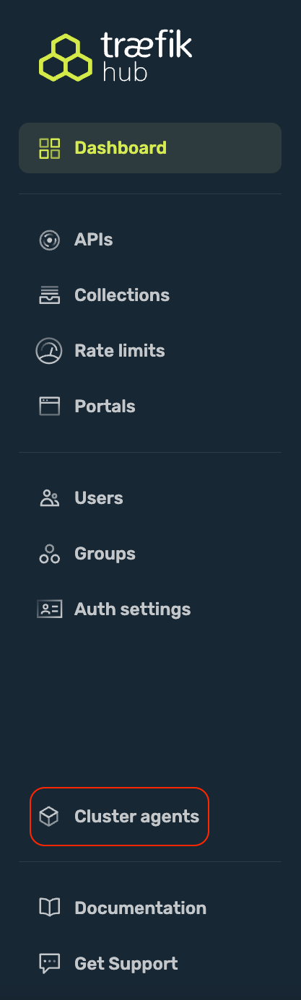
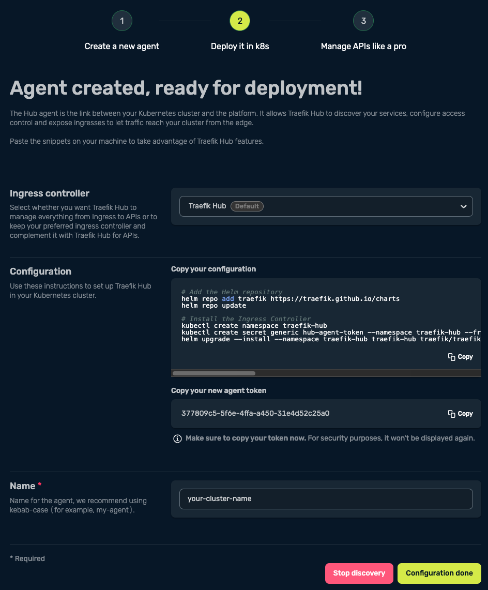
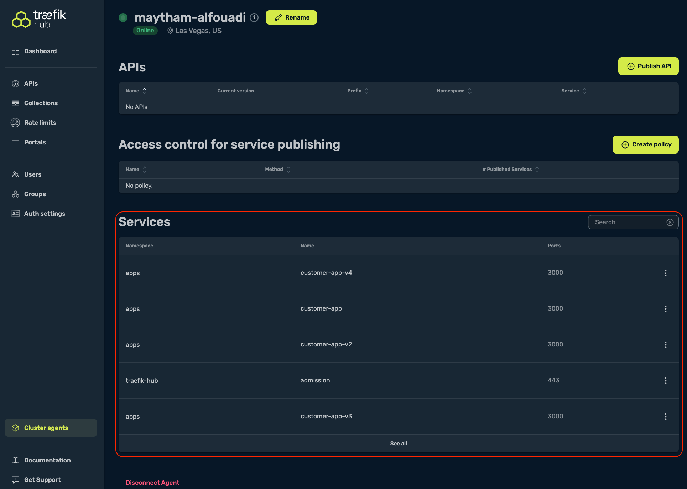

<br/>

<div align="center" style="margin: 30px;">
<a href="https://hub.traefik.io/">
  
</a>
<br />
</div>
<div align="center">
    <a href="https://hub.traefik.io">Log In</a> |
    <a href="https://doc.traefik.io/traefik-hub/">Documentation</a> 
</div>

# What is Traefik Hub

Traefik Hub is the industry’s first Kubernetes-native API Management solution for publishing, securing, and managing APIs.

Traefik Hub, purpose-built for K8s environments and GitOps workflows, drastically simplifies and accelerates the API lifecycle management, so organizations experience quick time to value, unleash workforce productivity, and focus on building great applications.

<br>

___

## Get started with Traefik Hub

1. login to Traefik Hub using the below credentials:


&nbsp;&nbsp;&nbsp;&nbsp;&nbsp;&nbsp;&nbsp;&nbsp;&nbsp;&nbsp;https://hub.traefik.io                             

&nbsp;&nbsp;&nbsp;&nbsp;&nbsp;&nbsp;&nbsp;&nbsp;&nbsp;&nbsp;username: COMMON-USERNAME                         
&nbsp;&nbsp;&nbsp;&nbsp;&nbsp;&nbsp;&nbsp;&nbsp;&nbsp;&nbsp;password: COMMON-PASSWORD            

2. Navigate to "Cluster agents" and select "Create new agent"

<details><summary> :bulb: Hint</summary>
&nbsp;&nbsp;&nbsp;&nbsp;&nbsp;&nbsp;&nbsp;&nbsp;&nbsp;&nbsp;

</details>
</p>

3. 


> [!NOTE]     
> :pencil2: *Follow the instructions to install the Traefik Hub agent on your Kubernetes cluster.*   

</p>

&nbsp;&nbsp;&nbsp;&nbsp;&nbsp;&nbsp;&nbsp;&nbsp;&nbsp;&nbsp;

<p>
<div align="left">


```bash
k8s:~$ kubectl get pod --namespace traefik-hub
NAME                           READY   STATUS    RESTARTS   AGE
traefik-hub-596c9c846d-n94j4   1/1     Running   0          62s
```

</p>
</div>

4. Provide a name to your agent before selecting "Configuration Done." (example: <code>firstname-lastname</code>)

5. All Done! You should be able to see your cluster ONLINE

<p>

<br>

___


# Demo Application

## Overview

The demo application consists of 4 deployments (Customers, Employees, Flights, and Tickets) for a fictional company called Traefik Airlines. Each deployment is serving data based on statically defined entries purposely defined to simulate API requests. 

## Deploy the Demo application

> [!NOTE]     
> :pencil2: *Run below steps in your cluster.*


1. Clone git repo into your client

    ```bash
    git clone <GIT-REPO-URL>
    ```

2. Update the cloned repo with your cluster External IP. We are utilizing sslip.io for DNS services. 

    ```bash
    export EXTERNAL_IP=$(kubectl get svc/traefik-hub -n traefik-hub --no-headers | awk {'print $4'})
    ```
    ```bash
    for i in $(grep -Rl '${EXTERNAL_IP}'); do sed -i 's/${EXTERNAL_IP}/'$EXTERNAL_IP'/g' $i; done

    ```

3. Create a new namespace for the application

    ```bash
    kubectl create namespace apps
    ```

4. Deploy the demo app.

    ```bash
    kubectl apply -f module-1/apps/customers/ -f module-1/apps/employee/ -f module-1/apps/flight/ -f module-1/apps/ticket/ -f module-1/apps/external/ -f module-1/apps/whoami.yaml
    ```

<p>
<div align="left">
  <details><summary>Expected output</summary>
  
  <p>
  
  ```bash
  kubectl get pod,svc --namespace apps
  NAME                                   READY   STATUS    RESTARTS   AGE
  pod/customer-app-v4-795fbf45bf-cqss2   1/1     Running   0          84s
  pod/customer-app-v3-698c85568c-nsv54   1/1     Running   0          84s
  pod/employee-app-6d7656d69f-m8lnr      1/1     Running   0          84s
  pod/flight-app-8f696784f-g8qn8         1/1     Running   0          83s
  pod/customer-app-59bcb5b9bc-4z7xw      1/1     Running   0          84s
  pod/ticket-app-867959bdbd-vkwx5        1/1     Running   0          83s
  pod/customer-app-v2-5ccf4544f7-tv7lt   1/1     Running   0          84s
  pod/whoami-697f8c6cbc-qp5nw            1/1     Running   0          84s
  
  NAME                      TYPE           CLUSTER-IP      EXTERNAL-IP        PORT(S)    AGE
  service/customer-app-v2   ClusterIP      10.43.233.33    <none>             3000/TCP   84s
  service/customer-app-v3   ClusterIP      10.43.47.208    <none>             3000/TCP   84s
  service/customer-app-v4   ClusterIP      10.43.127.91    <none>             3000/TCP   84s
  service/customer-app      ClusterIP      10.43.64.46     <none>             3000/TCP   84s
  service/employee-app      ClusterIP      10.43.211.198   <none>             3000/TCP   84s
  service/flight-app        ClusterIP      10.43.174.194   <none>             3000/TCP   83s
  service/ticket-app        ClusterIP      10.43.73.169    <none>             3000/TCP   83s
  service/world-time-api    ExternalName   <none>          worldtimeapi.org   443/TCP    83s
  service/whoami            ClusterIP      10.43.142.176   <none>             80/TCP     84s
  ```
  </details>
</p>
</div>

5. [Optional] Explore the application from the Traefik Hub dashboard

    - From the Traefik Hub dashboard, navigate to Cluster Agents and select your cluster. 
    - Under services, Traefik Hub has automatically detected all services running in your cluster.  

    

</br>

## Reference

- Install the Traefik Hub Agent  
https://doc.traefik.io/traefik-hub/operations/installation/ingress-mode/

</br>

------
:house: [HOME](../README.md) | :arrow_forward: [module-2](../module-2/readme.md)
