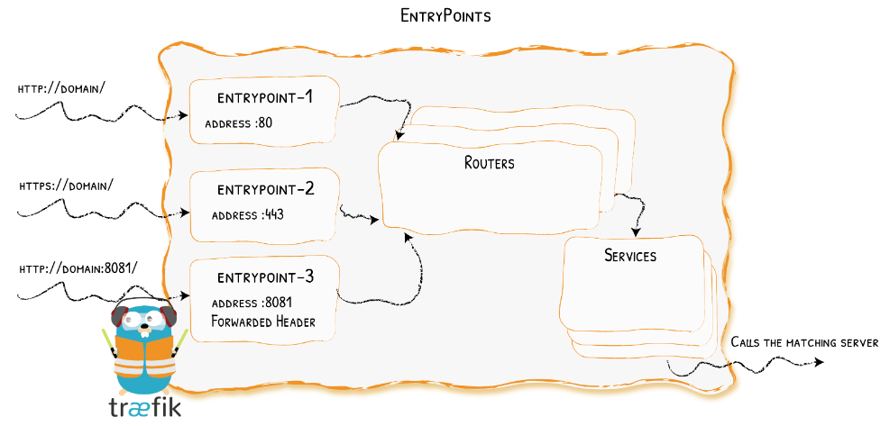
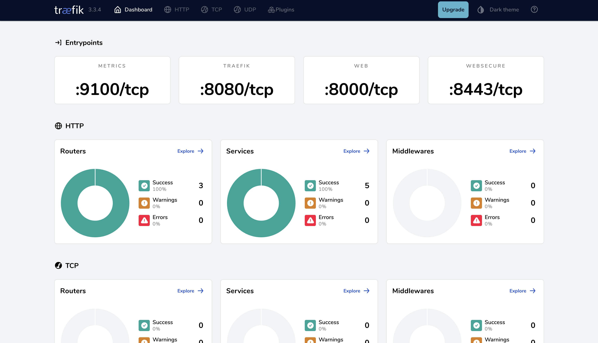
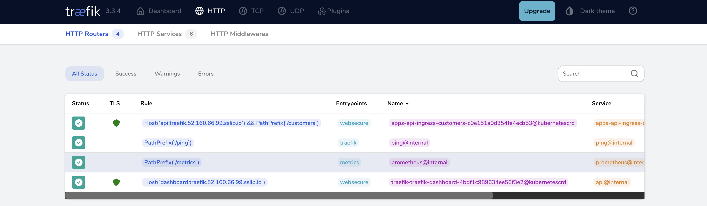
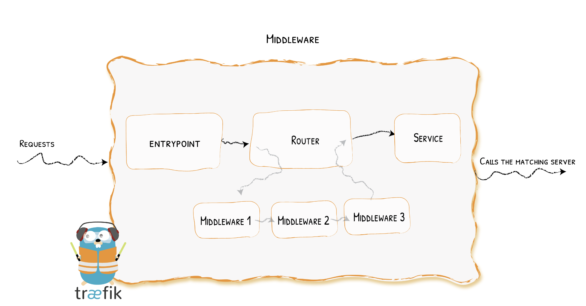
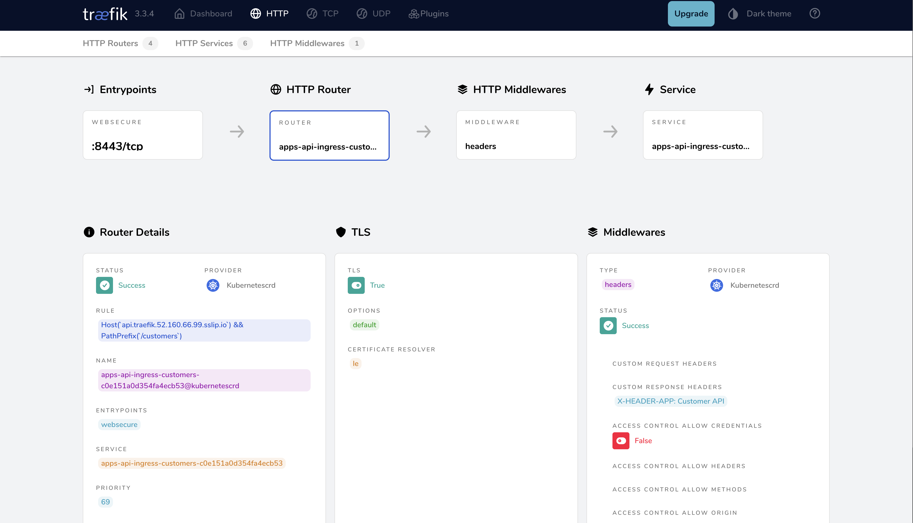

<br/>

<div align="center" style="margin: 30px;">
<a href="https://traefik.io/traefik/">
  
</a>
<br />
</div>
<div align="center">
  <a href="https://traefik.io/traefik/">Website</a> |
  <a href="https://doc.traefik.io/traefik/">Documentation</a>
</div>

<br>

# What is Traefik Application Proxy

Traefik Application Proxy is a cloud-native, GitOps-driven, lightweight ingress controller that embraces Kubernetes architecture in its design. It allows seamless migration from Proxy to API gateway and full API management lifecycle solution without interrupting your existing services.

## Concepts

Traefik Application proxy is based on the concept of **EntryPoints**, **Routers**, **Middlewares** and **Services**.

- **EntryPoints**: are the network entry points into Traefik. They define the port to receive the packets and whether to listen for TCP or UDP.
- **Routers**: are the bridge between the incoming requests and the backend services.
- **Middlewares**: Attached to the routers, middlewares can modify the requests or responses before they are sent to your service.
- **Services**: are responsible for configuring how to reach the application that will eventually handle the incoming requests.



<br>
___

## Get started with Traefik Application Proxy

> [!IMPORTANT]
> :pencil2: Run the steps below in your cluster. Traefik has already been installed with Terraform in module-0.

1. Generate application manifests from templates using your cluster External IP. We are utilizing sslip.io for DNS services.

```bash
export EXTERNAL_IP=$(terraform output -raw external_ip)
for i in {1..4}; do \
  rm -rf module-$i/manifests && \
  cp -r module-$i/templates module-$i/manifests && \
  find module-$i/manifests -type f -exec sed -i '' \
    -e "s/\${EXTERNAL_IP}/$EXTERNAL_IP/g" \
    -e "s/<tenant-id>/$(terraform output -raw tenant_id)/g" \
    -e "s/<client-id>/$(terraform output -raw application_client_id)/g" \
    -e "s/<client-secret>/$(terraform output -raw application_client_secret)/g" {} + 2>/dev/null || true
done
```

2. Publish the Traefik Dashboard.

```bash
kubectl apply -f module-1/manifests/dashboard-ingress.yaml
```
   
Traefik uses **IngressRoute** to publish the application based on the concept of **EntryPoint**, **Routers**, **Middleware** and **Service**.

```yaml
apiVersion: traefik.io/v1alpha1
kind: IngressRoute
metadata:
  name: traefik-dashboard
  namespace: traefik
spec:
  entryPoints:                                                # Network port which will receive the packet (HTTP, HTTPS, TCP,..etc).
    - websecure
  routes:
  - match: Host(`dashboard.traefik.${EXTERNAL_IP}.sslip.io`)  # URL to match before routing to backend service
    kind: Rule
    services:                                                 # Backend service name and port number.
    - name: api@internal
      kind: TraefikService
  tls:                                                        # LetsEncrypt to auto-generate certificate for the application
    certResolver: le
```

3. Verify Access to the Traefik Dashboard

- View dashboard ingress definition.
```bash
kubectl --namespace traefik describe ingressroute traefik-dashboard
```
- From the browser, navigate to the **Host** URL defined in dashboard-ingress manifest file.

example:
```bash
echo https://dashboard.traefik.$(terraform output -raw external_ip).sslip.io
```

- We should be able to access the Traefik Proxy Dashboard

<details><summary> :bulb: Traefik Dashboard</summary>
    
</details>

___


# Demo Application

## Overview

The demo application consists of 4 deployments (Customers, Employees, Flights, and Tickets) for a fictional company called Traefik Airlines. Each deployment is serving data based on statically defined entries purposely defined to simulate API requests.

## Deploy the Demo application

> [!IMPORTANT]
> :pencil2: *Run below steps in your cluster.*

Create a new namespace and deploy the demo applications that we will use throughout the lab

```bash
kubectl create namespace apps
kubectl apply -f module-1/manifests/customers/ -f module-1/manifests/employee/ -f module-1/manifests/flight/ -f module-1/manifests/ticket/ -f module-1/manifests/external/ -f module-1/manifests/whoami/whoami.yaml
```

## Publish the demo app

1. To publish **customer-app** as an example to the outside world, we must apply an ingress definition that will instruct Traefik to route the incoming request to the backend service.

```yaml
apiVersion: traefik.io/v1alpha1
kind: IngressRoute
metadata:
  name: api-ingress-customers
  namespace: apps                                                                     # Namespace where the application is deployed.
spec:
  entryPoints:
    - websecure                                                                       # Request is coming on HTTPS (port 443).
  routes:
    - kind: Rule
      match: Host(`api.traefik.${EXTERNAL_IP}.sslip.io`) && PathPrefix(`/customers`)  # Traefik will be monitoring for this specific URL.
      services:
        - name: customer-app                                                          # The request routed to customer-app service on port 3000.
          port: 3000
  tls:
    certResolver: le
```

> [!IMPORTANT]
> :pencil2: *Let's apply the IngressRoute definition.*

```bash
kubectl apply -f module-1/manifests/customers/ingress/customer-ingress.yaml
```

2. Traefik Dashboard will list the newly created route.



3. Verify connectivity to the customer-app API.

```bash
kubectl -n apps describe ingressroute api-ingress-customers
```
```bash
curl  https://api.traefik.$(terraform output -raw external_ip).sslip.io/customers
```

```json
{
  "customers": [
    { "id": 1, "firstName": "John", "lastName": "Doe", "points": 100, "status": "bronze" },
    { "id": 2, "firstName": "Jane", "lastName": "Doe", "points": 200, "status": "silver" },
    { "id": 3, "firstName": "John", "lastName": "Smith", "points": 300, "status": "gold" }
  ]
}
```

## Tweak incoming request with middleware

1. Middlewares are attached to the ingress definition to tweak the request before passing it to the application service. Middlewares can be used to modify the request, the headers, in charge or redirection, etc.



2. Header middleware, for example, can be used to manage the headers of the requests and responses. In the below example, the middleware will add a custom header to the response received from the application back to the client.

```yaml
apiVersion: traefik.io/v1alpha1
kind: Middleware
metadata:
  name: customer-header                 # Name of the middleware
  namespace: apps                       # Namespace where the middleware will deployed.
spec:
  headers:                              # Type of the middleware
    customResponseHeaders:
      X-HEADER-APP: "Customer API"
  ```

3. The middleware must be attached to the ingress definition to tweak the request. Multiple middlewares can be combined into a chain to fit every scenario.

Let us modify customer-ingress.yaml definition to add the header middleware.

```yaml
apiVersion: traefik.io/v1alpha1
kind: IngressRoute
metadata:
  name: api-ingress-customers
  namespace: apps                                                                     # Namespace where the application is deployed.
spec:
  entryPoints:
    - websecure                                                                       # Request is coming on HTTPS (port 443).
  routes:
    - kind: Rule
      match: Host(`api.traefik.${EXTERNAL_IP}.sslip.io`) && PathPrefix(`/customers`)  # Traefik will be monitoring for this specific URL.
      services:
        - name: customer-app                                                          # The request is routed to customer-app service on port 3000.
          port: 3000
      middlewares:
        - name: customer-header                                                       # <<< Specify the name of the middleware that we need to associate with the route.
  tls:
    certResolver: le
```

4. Apply the updated ingress definition with the header middleware.

> [!IMPORTANT]
> :pencil2: *Run the below step in your cluster.*

```bash
kubectl apply -f module-1/manifests/customers/ingress/customer-ingress-middleware.yaml
```

5. Verify the new custom header is received

```bash
curl -I https://api.traefik.$(terraform output -raw external_ip).sslip.io/customers
```

```
HTTP/2 200
date: Thu, 01 Aug 2024 18:30:32 GMT
x-header-app: Customer API              <<< New custom response header added by the middleware
```

The Traefik Dashboard lists the middleware as part of the route definition.



## Publish all applications

Now that we understand how to publish an application using **IngressRoute** and tweak the request with **middelware**, let us publish all the demo apps that we have deployed.

```bash
kubectl apply -f module-1/manifests/employee/ingress/ -f module-1/manifests/flight/ingress/ -f module-1/manifests/ticket/ingress/ -f module-1/manifests/external/ingress/ -f module-1/manifests/whoami/ingress/
```

## Reference

- Traefik concept.
https://doc.traefik.io/traefik/getting-started/concepts/
- Traefik Proxy install.
https://doc.traefik.io/traefik/getting-started/install-traefik/
- Traefik middlewares.
https://doc.traefik.io/traefik/middlewares/overview/

<br>

------
:house: [HOME](../README.md) | :arrow_forward: [Module 2: Traefik Hub API Gateway](../module-2/readme.md)
