 

  
</a>
 

## Setup EntraID integration with Traefik Hub

### Create Demo Users

1. From Microsoft Entra ID, navitage to **Manage** and then **Users**.
2. From **New User**, select **Create New User**. 

3. Create **ms-admin** and **ms-support** user accounts as shown below: 

   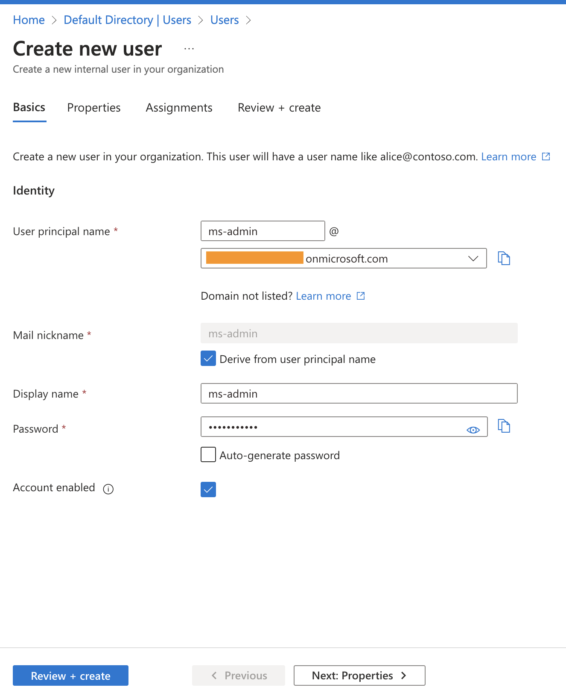

5. We should have two accounts created.

   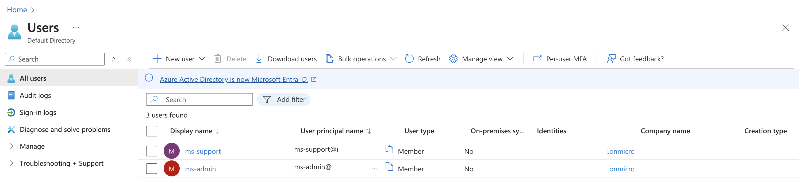

### Create Demo Groups

1. From Microsoft Entra ID, navitage to **Manage** and then **Groups**.
2. Select **New Group** and create **admin** and **support** groups as shown below.   
   >_Ensure to add **ms-admin** user to **admin** group under **Members** section_.   

   >_Ensure to add **ms-support** user to **support** group under **Members** section_. 

   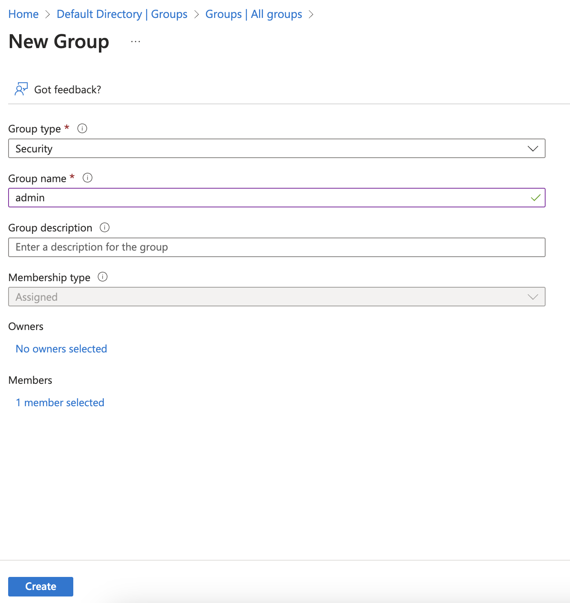

3. We should have two groups created as shown below

   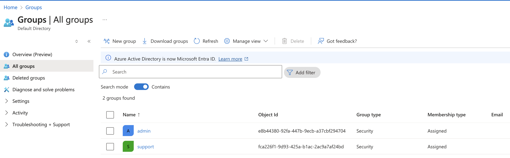

### Create App Registration

1. From Microsoft Entra ID, navitage to **Manage** and then **App Registrations**.
2. Select **New Registrations** and create **traefik-workshop** app registration as shown below. 

   >_Ensure to change EXTERNAL_IP to your Loadbalancer IP_.     

   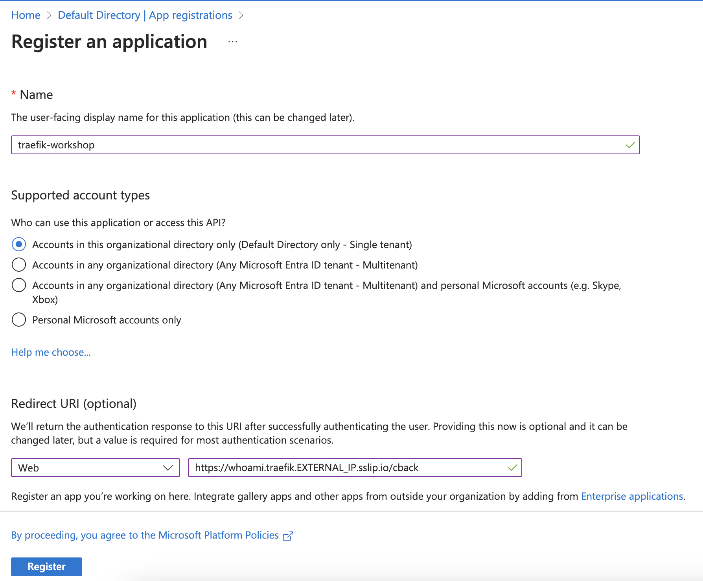

### Configure App Registration

#### A. Update Authorization URLs

1. From **traefik-workshop**, navigate to **Manage**, **Authentication**.
2. Under **Web**, **Redirect URIs** section, select **add URI**. Update the list as shown below to include the portal URL, too:

   >_Ensure to change EXTERNAL_IP to your Loadbalancer IP_.   

   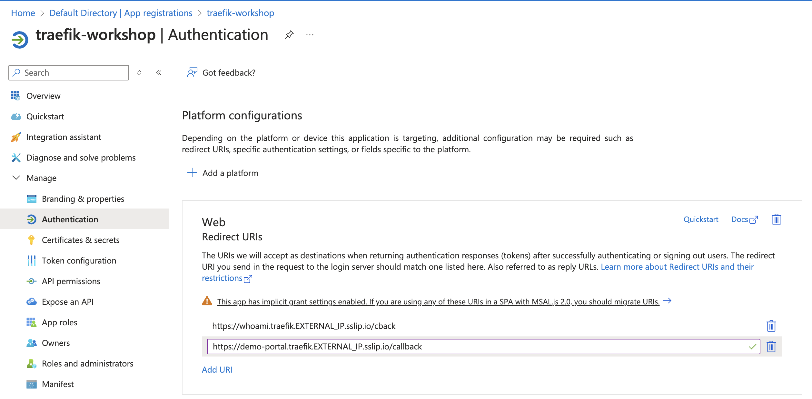

#### B. Expose an API

1. From **traefik-workshop**, navigate to **Manage**, **Authentication**.
2. Select **Add** for **Application ID URI** and then select **Save**.
3. Select **Add a scope** and fill in the information as shown below to prepare for returning the group information of the users.

   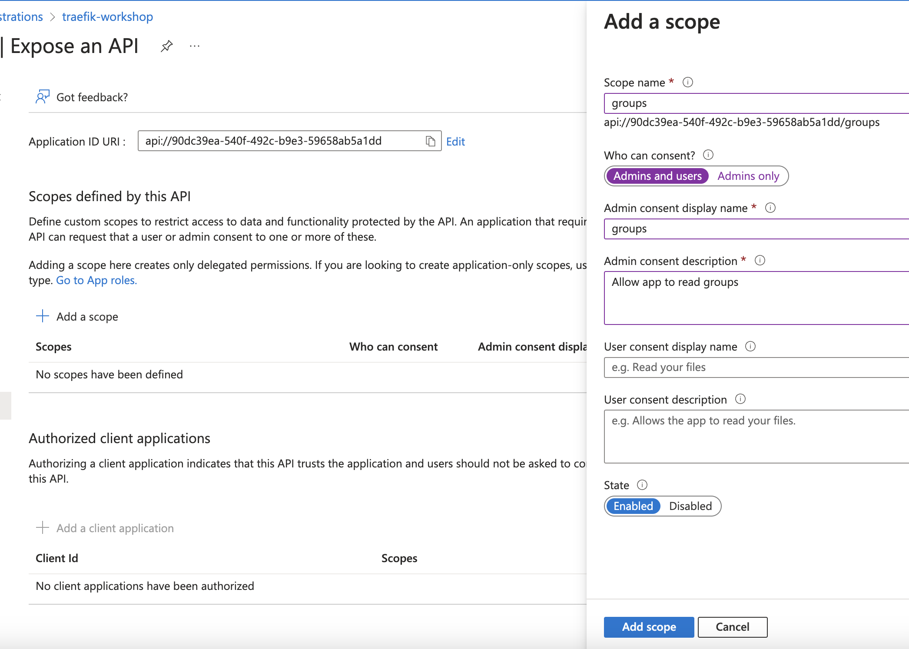

#### C. Create a Secret

1. From **traefik-workshop**, navigate to **Manage**, **Certificates and Secrets**.
2. Under **Client Secrets**, select **New client secret**. Provide description and set the expiry date and select **add**
3. Store the secret **value** locally as this will be required when we define Traefik OIDC and JWT middlewares. 

   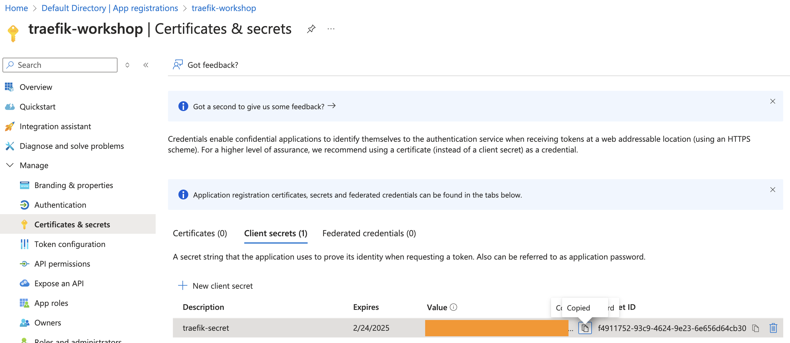

#### D. Create an App Role

1. From **traefik-workshop**, navigate to **Manage**, **App roles**.
2. Select **Create app role** to create **admin** and **support** roles. Fill in the information as shown below for each of the roles. 

    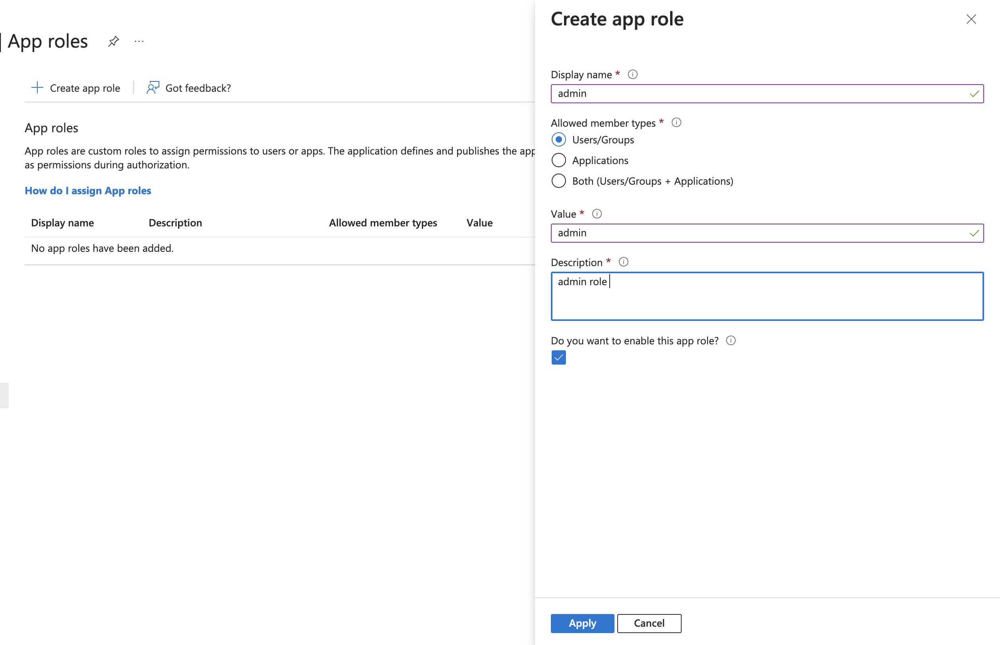

3. We should have below roles created. 

    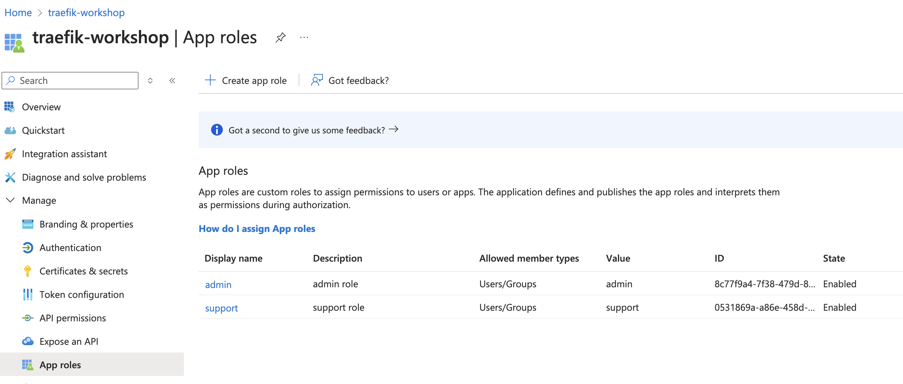

### Assign App role to a user

1. From Microsoft Entra ID, navitage to **Manage** and then **Enterprise Applications**.
2. Under **All applications**, select **traefik-workshop** application. 
3. Navigate to **Manage**, **Users and Groups**, select **Add user/group**.
4. Fill in the form to assign **ms-admin** user to **admin** role. Similarly, assign **ms-support** to **support** role.  

    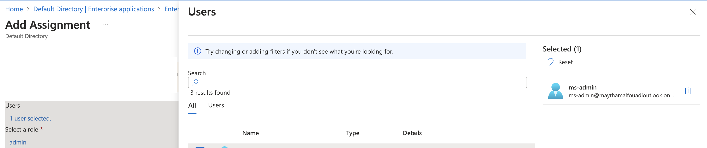

5. We should have two **User** to **Role** assignments.

    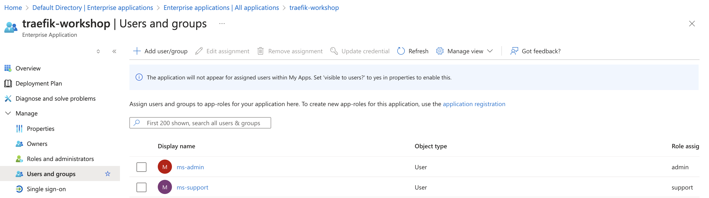

------
:house: [HOME](../README.md) | :twisted_rightwards_arrows: [Return to module 2: Traefik Hub API Gateway](../module-2/readme.md#secure-access-to-your-application)