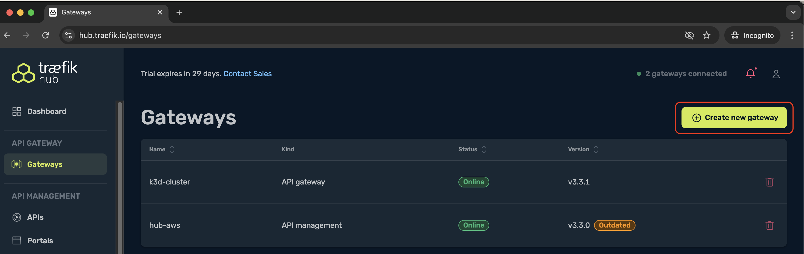
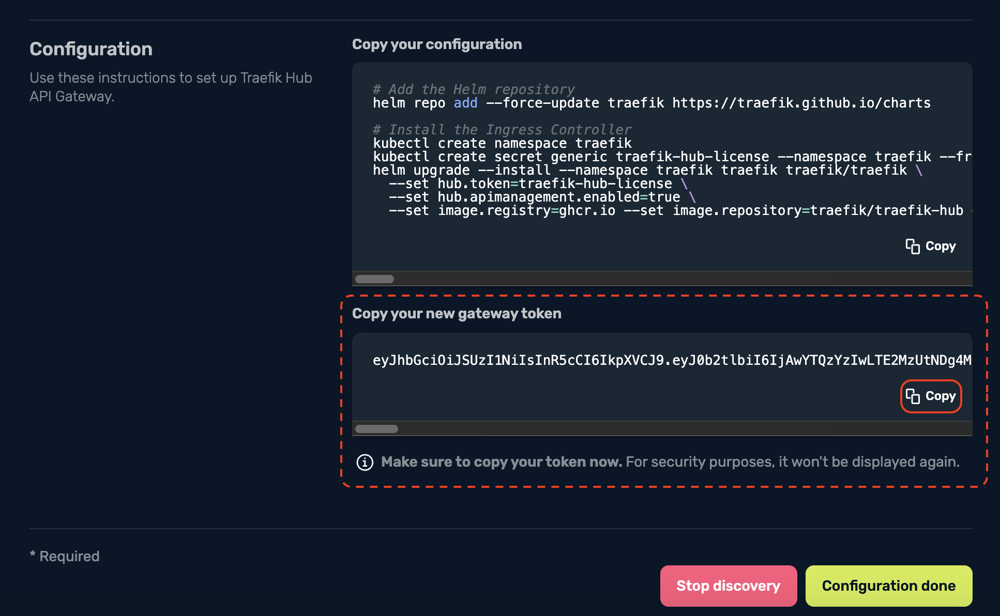
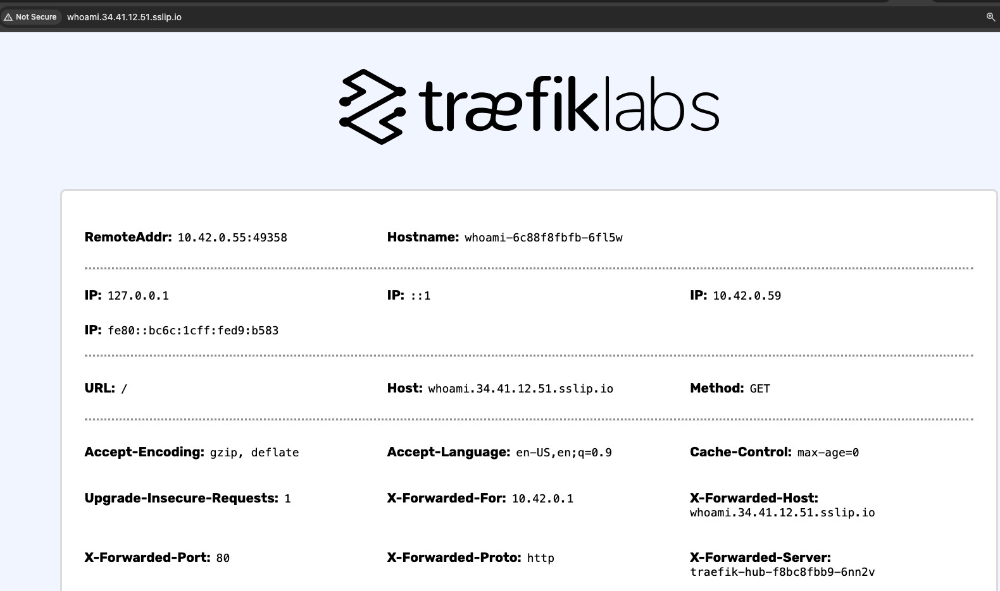
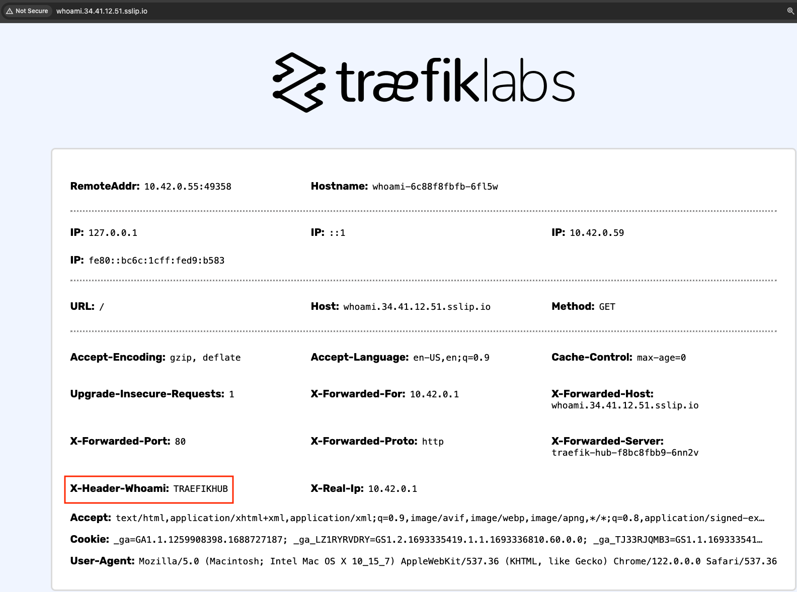

<br/>

<div align="center" style="margin: 30px;">
<a href="https://traefik.io/traefik-hub-api-gateway">
  
</a>
<br />
</div>
<div align="center">
    <a href="https://traefik.io/traefik-hub-api-gateway/">Website</a> |
    <a href="https://doc.traefik.io/traefik-hub/api-gateway/api-gateway-intro">Documentation</a> 
</div>

# Traefik Hub API Gateway

## Overview:

The Traefik Hub API Gateway combines the world’s most trusted cloud native, fully declarative application proxy with enterprise-grade access control, distributed security, and premium integrations. 

In this module, we will go through the steps on how to perfrom seamless upgrade of <b>Traefik Application Proxy</b> to <b>Traefik Hub API Gateway</b> with minimum imapct to existing services.  

<br>

___

## Upgrade Traefik Application Proxy to Traefik Hub API Gateway:

1. Traefik Hub API Gateway requires a license key. To obtain a license key, login to <b><a href="https://hub.traefik.io/dashboard">Traefik Hub Dashboard</a></b>           

    username: COMMON-USERNAME                         
    password: COMMON-PASSWORD      

2. Navigate to <b>Gateways</b> and select <b>Create new gateway</b> 

         

3. Copy your new gateway token.     

   

4. Store the new gateway token as environment variable in your terminal.      

    ```bash 
    export TRAEFIK_HUB_TOKEN=
    ```
5. Create a secret to store the newly obtain gateway token.    

    ```bash
    kubectl create secret generic traefik-hub-license --namespace traefik --from-literal=token=$TRAEFIK_HUB_TOKEN
    ```
6. Now that the license key is stored under the same namespace as our existing Traefik Application proxy deployment, we can perform in-place upgrade to <b>Traefik Hub API Gateway</b> using the same Helm chart. 

    ```bash
    helm upgrade traefik -n traefik --wait \
      --reuse-values \
      --set hub.token=traefik-hub-license \
      --set image.registry=ghcr.io \
      --set image.repository=traefik/traefik-hub \
      --set image.tag=v3.3.1 \
       traefik/traefik
   ```

7. Once the Helm upgrade command is executed successfully, you can refresh the Traefik Dashboard webpage and you will be presented with the new UI. Since <b>Traefik API Gateway</b> is based on <b>Traefik Application Proxy</b>, there is no impact to any of the existing services. 

___

## Secure access with JWT         


whoami application was deployed in module-1. Below steps will need to be followed to expose the application. 

```bash
kubectl -n apps get pod,svc | egrep "NAME|whoami"

NAME                                   READY   STATUS    RESTARTS        AGE
pod/whoami-697f8c6cbc-qp5nw            1/1     Running   0               68m

NAME                      TYPE           CLUSTER-IP      EXTERNAL-IP        PORT(S)    AGE
service/whoami            ClusterIP      10.43.142.176   <none>             80/TCP     164m
```


1. By default, Traefik Hub agent is configured with <b>*web*</b> (port 80) and <b>*websecure*</b> (port 443) EntryPoints. Similar to Traefik Proxy, you can define custom EntryPoints using static config. 
2. Define the route to the backend service using <b>IngressRoute</b> Kubernetes custom resource definition.


    ```yaml
    apiVersion: traefik.io/v1alpha1
    kind: IngressRoute
    metadata:
      name: whoami-ingress                      # IngressRoute Name
      namespace: apps                           # Namespace where the backend service is running. 
    spec:
      entryPoints:
        - web                                   # EntryPoint where Traefik is listening on for incoming requests. 
      routes:
        - kind: Rule
          match: Host(`whoami.URL`)             # match the request with this URL
          services:
            - name: whoami                      # Forward the request to backend service
              port: 80                          # Backend service is listening on Port 80.
    ```

3. Deploy IngressRoute definition.  

> [!NOTE]     
> :pencil2: *Run below steps in your cluster.*

```bash
kubectl apply -f module-2/manifests/whoami-ingressroute.yaml
```
```bash
# Verify IngressRoute

kubectl -n apps get ingressroute.traefik.io

NAME             AGE
whoami-ingress   173m
```
```bash
kubectl -n apps describe ingressroute.traefik.io

Name:         whoami-ingress
Namespace:    apps
Labels:       <none>
Annotations:  <none>
API Version:  traefik.io/v1alpha1
Kind:         IngressRoute
Metadata:
  Creation Timestamp:  2024-02-29T18:34:03Z
  Generation:          1
  Resource Version:    1230
  UID:                 306f20de-9c84-4a81-9c2b-02e06360c89f
Spec:
  Entry Points:
    web
  Routes:
    Kind:   Rule
    Match:  Host(`whoami.EXTERNAL_IP.sslip.io`)      # URL the service is exposed on
    Services:
      Name:  whoami
      Port:  80
Events:      <none>
```

4. The whoami application should be accessible using the URL defined in the IngressRoute definition. 

    <details><summary>Expected output</summary>

    
    </details>  

<br>

___

## Traffic modification with Middlewares:

Middlewares are attached to the routers and it can tweak the incoming requests before it is handed over to the backend service. Depends on the middleware in use, Traefik can modify the incoming requests, the headers, the responses sent by the backend service, and it can also re-direct the requests, apply authentications and many more. 

To add a custom header to the incoming request, follow below steps:

1. Create a middleware definition to add custom header

    ```yaml
    apiVersion: traefik.io/v1alpha1
    kind: Middleware
    metadata:
      name: whoami-header                       # Name of the middleware.
      namespace: apps                           # Namespaec where the backend service is running.
    spec:
      headers:                                  # Type of middleware
        customRequestHeaders:                   # Add Custom Header to the request
          X-HEADER-WHOAMI: "TRAEFIKHUB"         
    ```
2. Deploy the middleware definition

> [!NOTE]     
> :pencil2: *Run below steps in your cluster.*

```bash
kubectl apply -f module-2/manifests/whoami-middleware.yaml
```    
```bash
# Verify middleware
kubectl -n apps get middleware.traefik.io
NAME            AGE
whoami-header   178m
```

3. Middleware needs to be attached to the router for it to tweak the traffic. Modify <b>*whoami-ingressroute*</b> definition file to reference the middleware. 

> [!NOTE]     
> :pencil2: *Edit whoami-ingressroute.yaml file*

```bash
vi module-2/manifests/whoami-ingressroute.yaml
```
```yaml
---
apiVersion: traefik.io/v1alpha1
kind: IngressRoute
metadata:
  name: whoami-ingress
  namespace: apps
spec:
  entryPoints:
    - web
  routes:
    - kind: Rule
      match: Host(`whoami.URL`)
      services:
        - name: whoami
          port: 80
      middlewares:                  # Attach middlewares under routes definition  
        - name: whoami-header       # Which middleware should be attached to this route. 
```
4. Re-deploy <b>whoami-ingressroute.yaml</b> manifest file for the new changes to take effect. 


    ```bash
    kubectl apply -f module-2/manifests/whoami-ingressroute.yaml
    ```

    <details><summary>Expected output</summary>

    
    </details>  

<br>

___

## Securing whoami application with OIDC and Azure Entra ID:


## References:

- 

------
:house: [HOME](../README.md) | :arrow_forward: [module-3](../module-3/readme.md)