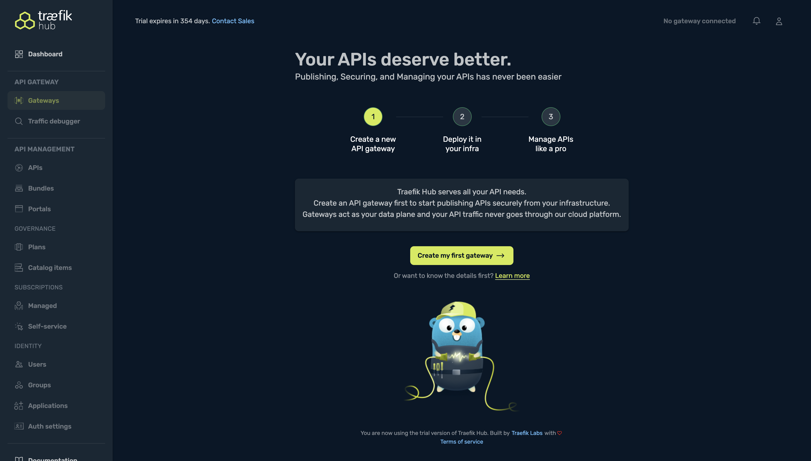
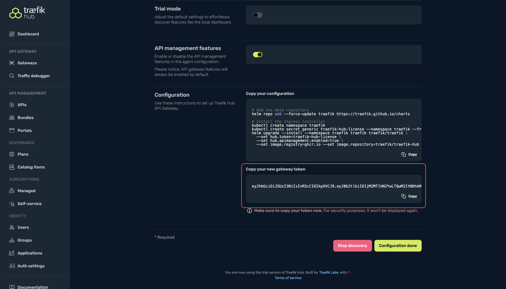
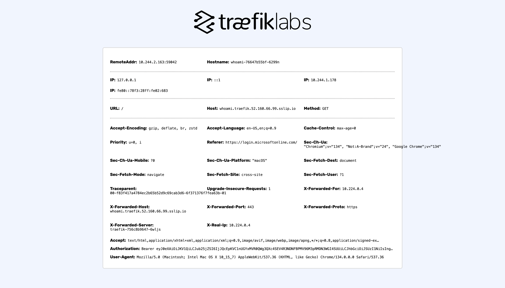

<br/>

<div align="center" style="margin: 30px;">
<a href="https://traefik.io/traefik-hub-api-gateway">
  
</a>
<br />
</div>
<div align="center">
    <a href="https://traefik.io/traefik-hub-api-gateway/">Website</a> |
    <a href="https://doc.traefik.io/traefik-hub/api-gateway/api-gateway-intro">Documentation</a>
</div>

# Traefik Hub API Gateway

## Overview

The Traefik Hub API Gateway combines the world’s most trusted cloud native, fully declarative, multitenant application proxy with enterprise-grade access control, distributed security, and premium integrations.

In this module, we will go through the steps on how to perform a seamless upgrade of **Traefik Application Proxy** to **Traefik Hub API Gateway** with minimum impact on existing services.

<br>

___

## Upgrade Traefik Application Proxy to Traefik Hub API Gateway

> [!IMPORTANT] 
> :pencil2: Run the steps below in your cluster.

1. Traefik Hub API Gateway requires a license key. To obtain a license key, login to **<a href="https://hub.traefik.io/dashboard">Traefik Hub Dashboard</a>**

    ```console
    email: WORKSHOP-EMAIL
    password: WORKSHOP-PASSWORD
    ```

2. Navigate to **Gateways** and select **Create new gateway**

    

3. Copy your new gateway token.

    

4. Store the new gateway token as an environment variable in your terminal.

    ```bash 
    export TRAEFIK_HUB_TOKEN=
    ```
5. Create a secret to store the newly obtained gateway token.

    ```bash
    kubectl create secret generic traefik-hub-license --namespace traefik --from-literal=token=$TRAEFIK_HUB_TOKEN
    ```
6. Now that the license key is stored under the same namespace as our existing Traefik Application proxy deployment, we can upgrade to **Traefik Hub API Gateway** using Terraform.

    ```bash
    terraform apply -auto-approve -var="subscription_id=$(az account show --query id -o tsv)" -var="enable_api_gateway=true"
    ```

7. Once Terraform completes successfully, you can refresh the Traefik local dashboard and be presented with the new UI. Since **Traefik API Gateway** is based on **Traefik Application Proxy**, there is no impact on any of the existing services.

___

## Secure access to your application

Now that we have **Traefik Hub API Gateway** running, we can use some of the enterprise-level middleware to secure access to our application so only authorized users have access.

### Microsoft Entra ID

Microsoft Entra ID was installed and configured in module-0.

View **[Microsoft EntraID](../module-2/entraid.md)** section if you would like to understand what was deployed.

### Secure access with JWT

The JWT middleware verifies that a valid JWT token is provided in the Authorization header.

To add a JWT verification method to the incoming request for **customer-app** API application, follow the below steps:

1. Create JWT middleware definition

    ```yaml
    apiVersion: traefik.io/v1alpha1
    kind: Middleware
    metadata:
      name: jwt-azure
      namespace: apps
    spec:
      plugin:
        jwt:
          jwksUrl: "https://login.microsoftonline.com/common/discovery/v2.0/keys"
    ```

2. Update **customer-app's** **IngressRoute** definition to attach the newly created JWT middleware.

    ```yaml
    apiVersion: traefik.io/v1alpha1
    kind: IngressRoute
    metadata:
      name: api-ingress-customers
      namespace: apps                                                                     # Namespace where the application is deployed.
    spec:
      entryPoints:
        - websecure                                                                       # Request is coming on HTTPS (port 443).
      routes:
        - kind: Rule
          match: Host(`api.traefik.${EXTERNAL_IP}.sslip.io`) && PathPrefix(`/customers`)  # Traefik will be monitoring for this specific URL.
          services:
            - name: customer-app                                                          # The request is routed to customer-app service on port 3000.
              port: 3000
          middlewares:                                                                    
            - name: customer-header                                                       # CustomResponse Header.
            - name: jwt-azure  # Add JWT verification 
      tls:
        certResolver: le
    ```

> [!IMPORTANT]
> :pencil2: Run the steps below in your cluster.

```bash
kubectl apply -f module-2/manifests/customer-ingress.yaml
```

3. Any request to **customer-app** application will fail without a proper access token.

    ```bash
    curl -I https://api.traefik.$(terraform output -raw external_ip).sslip.io/customers
    ```
    ```
    HTTP/2 401 
    ```

4. Use the below command to obtain an access token from EntraID

    ```bash
    export access_token=$(curl -X POST -H 'Content-Type: application/x-www-form-urlencoded' \
    https://login.microsoftonline.com/$(terraform output -raw tenant_id)/oauth2/v2.0/token \
    -d "client_id=$(terraform output -raw application_client_id)" \
    -d 'grant_type=client_credentials' \
    -d 'scope=2ff814a6-3304-4ab8-85cb-cd0e6f879c1d%2F.default' \
    -d "client_secret=$(terraform output -raw application_client_secret)" | grep -o '"access_token":"[^"]*' | cut -d'"' -f4)
    ```

5. Now you can use the token to access the application:

    ```bash
    curl -H "Authorization: Bearer $access_token" https://api.traefik.$(terraform output -raw external_ip).sslip.io/customers
    ```

### Secure access with OIDC

The OpenID Connect Authentication middleware secures your applications by delegating the authentication to an external provider (ex: EntraID) and obtaining the end user's session claims and scopes for authorization purposes.

The middleware redirects to the authentication provider to authenticate the user. Once the authentication is complete, users are redirected back to the middleware before being authorized to access the upstream application.

1. We have **whoami** application running under **apps** namespace.


    ```bash
    kubectl -n apps get pod,svc | egrep "NAME|whoami"

    NAME                                   READY   STATUS    RESTARTS        AGE
    pod/whoami-697f8c6cbc-qp5nw            1/1     Running   0               68m

    NAME                      TYPE           CLUSTER-IP      EXTERNAL-IP        PORT(S)    AGE
    service/whoami            ClusterIP      10.43.142.176   <none>             80/TCP     68m
    ```

2. Create OIDC middleware to redirect the request to EntraID

    ```yaml
    ---
    apiVersion: traefik.io/v1alpha1
    kind: Middleware
    metadata:
      name: oidc-whoami
      namespace: apps
    spec:
      plugin:
        oidc:
          issuer: "https://login.microsoftonline.com/<tenant-id>/v2.0"
          clientID: "<client-id>"
          clientSecret: "<client-secret>"
          redirectUrl: "/cback"
    ```

2. Publish the service using **ingressroute** and attach the OIDC middleware to the route definition.

    ```yaml
    apiVersion: traefik.io/v1alpha1
    kind: IngressRoute
    metadata:
      name: whoami-ingress                      # IngressRoute Name
      namespace: apps                           # Namespace where the backend service is running.
    spec:
      entryPoints:
        - web                                   # EntryPoint where Traefik is listening on for incoming requests.
      routes:
        - kind: Rule
          match: Host(`whoami.URL`)             # match the request with this URL
          services:
            - name: whoami                      # Forward the request to the backend service
              port: 80                          # Backend service is listening on Port 80.
          middlewares:
            - name: oidc-whoami                 # List of middlewares that the request needs to go through.
    ```

> [!IMPORTANT]
> :pencil2: Run the steps below in your cluster.

    ```bash
    kubectl apply -f module-2/manifests/whoami-ingress.yaml
    ```

  <details><summary>Verification commands</summary>
  <br/>
  Verify IngressRoute
  ```bash
  kubectl -n apps get ingressroute.traefik.io whoami-ingress
  ```
  
  ```
  NAME             AGE
  whoami-ingress   173m
  ```

  ```bash
  kubectl -n apps describe ingressroute.traefik.io whoami-ingress
  ```
  
  ```
  Name:         whoami-ingress
  Namespace:    apps
  Labels:       <none>
  Annotations:  <none>
  API Version:  traefik.io/v1alpha1
  Kind:         IngressRoute
  Metadata:
    Creation Timestamp:  2024-02-29T18:34:03Z
    Generation:          1
    Resource Version:    1230
    UID:                 306f20de-9c84-4a81-9c2b-02e06360c89f
  Spec:
    Entry Points:
      web
    Routes:
      Kind:   Rule
      Match:  Host(`whoami.${EXTERNAL_IP}.sslip.io`)      # URL the service is exposed on
      Services:
        Name:  whoami
        Port:  80
  Events:      <none>
  ```

  Login to the whoami application:
  Username and password:
  ```bash
  echo $(terraform output -raw admin_email)
  ```
  ```bash
  echo $(terraform output -raw admin_password)
  ```

  ```bash
  echo https://whoami.$(terraform output -raw external_ip).sslip.io
  ```

  </details>
  <br/>

3. The whoami application should be accessible using the URL in the IngressRoute definition. The request will be redirected to EntraID for verification before being routed to the backend service.

    <details><summary>Expected output after successful login</summary>

    
    </details>

___

## References

- Traefik Hub API Gateway installation.
https://doc.traefik.io/traefik-hub/api-gateway/setup/installation/kubernetes
- JWT middleware.
https://doc.traefik.io/traefik-hub/api-gateway/secure/middleware/jwt
- OIDC middleware.
https://doc.traefik.io/traefik-hub/api-gateway/secure/middleware/oidc
- Get Microsoft EntraID token.
https://learn.microsoft.com/en-us/azure/databricks/dev-tools/service-prin-aad-token

------
:house: [HOME](../README.md) | :arrow_forward: [Module 3: Traefik Hub API Management](../module-3/readme.md)
