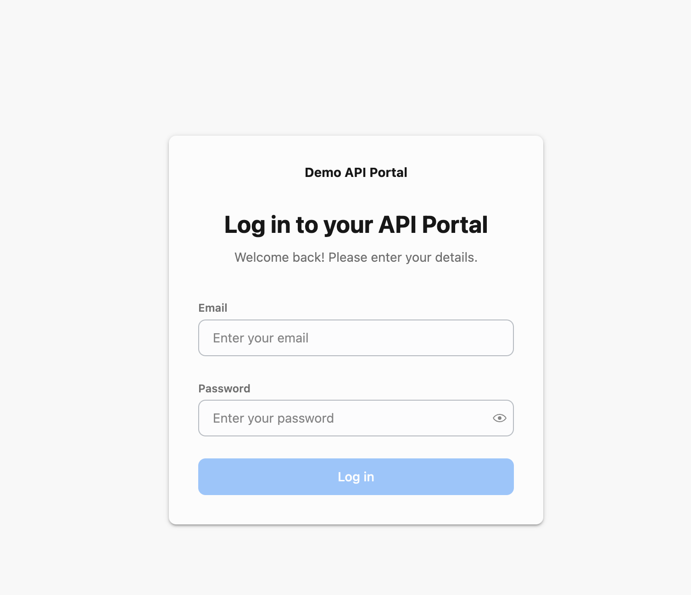
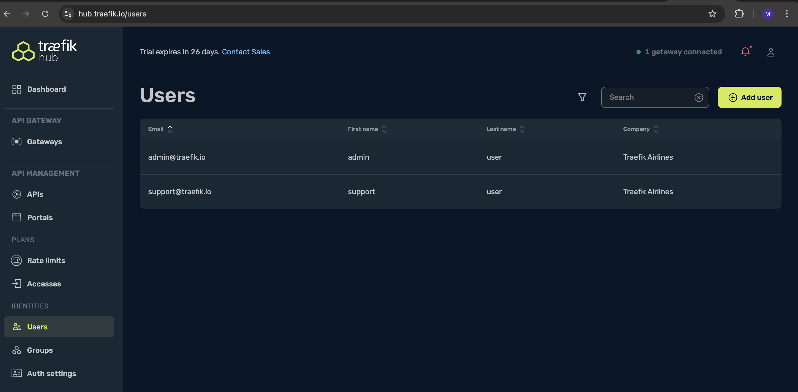
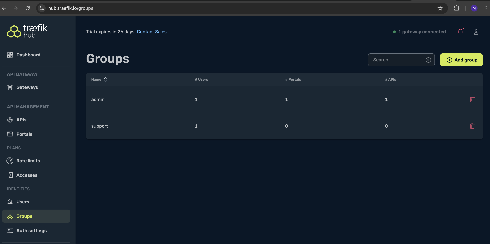
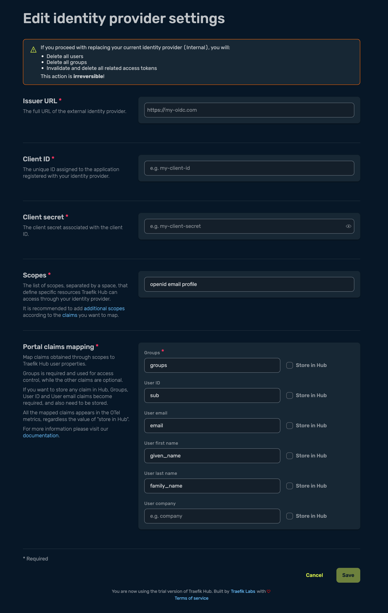

<br/>

<div align="center" style="margin: 30px;">
<a href="https://traefik.io/traefik-hub/">
  
</a>
<br/>
</div>
<div align="center">
    <a href="https://traefik.io/traefik-hub/">Website</a> |
    <a href="https://doc.traefik.io/traefik-hub/">Documentation</a> 
</div>
</br>

# Traefik Hub API Management

## Overview
Traefik Hub is the industry’s first Kubernetes-native API Management solution for publishing, securing, and managing APIs.

Traefik Hub, purpose-built for K8s environments and GitOps workflows, drastically simplifies and accelerates API lifecycle management. As a result, organizations experience quick time to value, unleash workforce productivity, and focus on building great applications.

## Upgrade API Gateway to API Management

Upgrading <b>Traefik Hub API Gateway</b> deployment to <b>API Management</b> has never been easier. The license key must be updated to include the API Management feature. Then, the <b>API Management</b> feature will need to be enabled using the below command:

> [!IMPORTANT]     
> :pencil2: *Follow the steps below to enable API Management features*.

```bash
helm upgrade traefik -n traefik --wait \
  --reuse-values \
  --set hub.apimanagement.enabled=true \
   traefik/traefik
```

## Manage an API with API Management Services

To manage an API application using API Management services, we will need to do the following:

1. Create an API object for Hub APIM service to manage.
2. Create an API Access object to control which group has access to this API.
3. Update the Ingress definition for the application to bind it to the newly created API. 

Let us promote <b>customer-app</b> API application to be managed by API Management services. 

1. Create an API object for <b>customer-app</b>.

   ```bash
   ---
   apiVersion: hub.traefik.io/v1alpha1
   kind: API                        # API Object
   metadata:
     name: customer-api             # Name of the object         
     namespace: apps                # Namespace where the app is deployed
     labels:
       area: customer               # Labels for easier referencing
       module: crm
   spec:
     openApiSpec:
       path: /openapi.yaml           # Path to OAS (OpenAPISpec)file
   ```
2. Create an API Access object to control access to this API. 

    ```bash
    ---
    apiVersion: hub.traefik.io/v1alpha1
    kind: APIAccess                         # API Access Object
    metadata:
      name: admin-access                    # Name of API Access
      namespace: apps                       # Namespace where App is deployed
    spec:
      groups:
        - admin                             # Admin group has access to the APIs matched under API selector section.
      apiSelector:
        matchExpressions:
          - key: area                       # Match any API with label that has "area" set as a key value. 
            operator: Exists 
    ```

3. Promote the existing <b>IngressRoute</b> to be managed by <b>APIM</b>.

   ```bash
   ---
   apiVersion: traefik.io/v1alpha1
   kind: IngressRoute
   metadata:
     name: api-ingress-customers
     namespace: apps
     annotations:                                      # Add API annotation to enable APIM
       hub.traefik.io/api: customer-api                # API object that the ingressroute needs to bind to.
   spec:
     entryPoints:
       - websecure
     routes:
       - kind: Rule
         match: Host(`api.traefik.EXTERNAL_IP.sslip.io`) && PathPrefix(`/customers`)
         services:
           - name: customer-app
             port: 3000
     tls:
       certResolver: le
   ```

> [!IMPORTANT]     
> :pencil2: *Follow the steps below to promote customer-api to be managed by APIM*.

```bash
kubectl apply -f module-3/manifests/customer-ingress-api.yaml
```

## API Developer Portal

Traefik Hub API Developer Portal allows developers to discover, access, and utilize API services. This platform serves as the space where API Users can explore, understand how to utilize the APIs, manage API Key access, and experiment with their functionalities.

Now that we have the application managed by Traefik Hub API Management services, let us deploy an API Developer portal so we can interact with the APIs

1. Deploy an API Dev Portal. 

   ```bash
   ---
   apiVersion: hub.traefik.io/v1alpha1
   kind: APIPortal
   metadata:
     name: demo-portal
     namespace: apps
   spec:
     title: Demo API Portal
     description: "Demo Developer Portal"
     trustedUrls:
       - https://demo-portal.traefik.EXTERNAL_IP.sslip.io
   ```
2. Create Ingress definition to publish API Dev Portal. 
   ```bash
   ---
   apiVersion: traefik.io/v1alpha1
   kind: IngressRoute
   metadata:
     name: demo-apiportal
     namespace: apps
     annotations:                              
       hub.traefik.io/api-portal: demo-portal          # Add annotation to reference api-portal object
   spec:
     entryPoints:
       - websecure
     routes:
     - match: Host(`demo-portal.traefik.EXTERNAL_IP.sslip.io`)
       kind: Rule
       services:
       - name: apiportal
         namespace: traefik
         port: 9903
     tls:
       certResolver: le
   ```

> [!IMPORTANT]     
> :pencil2: *Deploy API Dev Portal and IngressRoute*.

```bash
kubectl apply -f module-3/manifests/api-portal.yaml
```

3. Traefik Dashboard should list a new route for the api-portal. The portal can be accessible using the HOST URL defined in the Ingress definition

   ```bash
   https://demo-portal.traefik.EXTERNAL_IP.sslip.io
   ```
   <details><summary> :bulb: API Developer Portal </summary> 
   
   </details>


## API Dev Portal Access

The API Portal is automatically protected and requires a username/password to log in. 

Access can be defined using either a <b>built-in</b> identity provider or <b>any 3rd party IdP using OIDC</b>. 

### [Option 1] Built-in Identity Provider

This is the default option for any deployment. 

1. login to <b><a href="https://hub.traefik.io">Hub Dashboard</a></b> and create users and groups as shown below. 

   
   

2. Login to the API Dev Portal with user account that you just created (ex: admin@traefik.io)

### [Option 2] OIDC connection to EntraID

1. login to <b><a href="https://hub.traefik.io">Hub Dashboard</a></b> and navigate to <b>Auth settings</b>

2. Under <b>Portal</b> section, select OIDC and provide the identity provider details

   

## References

- Hub API Management upgrade guide.  
https://doc.traefik.io/traefik-hub/operations/upgrading
- APIM overview.    
https://doc.traefik.io/traefik-hub/api-management/apim-overview
- API Portal.      
https://doc.traefik.io/traefik-hub/portal/api-portal-overview
- APIM Authentication and Authorization.        
https://doc.traefik.io/traefik-hub/authentication-authorization/access-overview

</br>

------
:house: [HOME](../README.md) | :arrow_forward: [Module 4](../module-4/readme.md)
