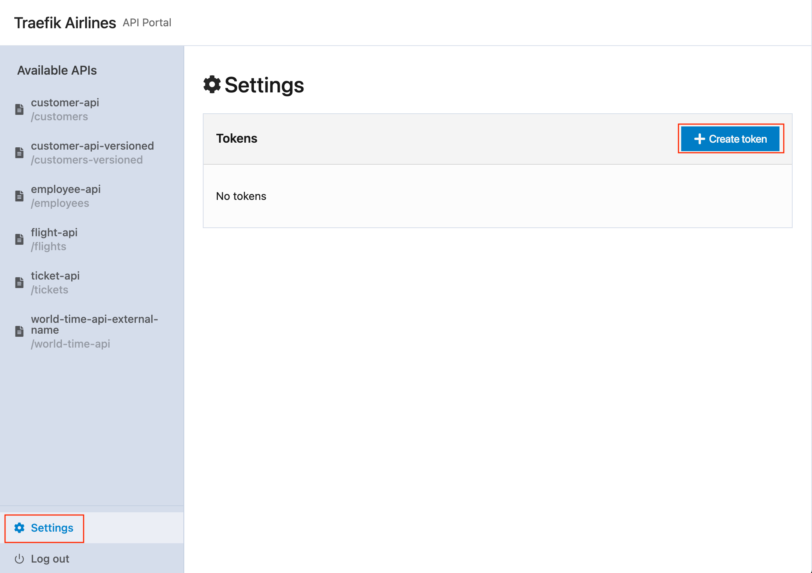

<br/>

<div align="center" style="margin: 30px;">
<a href="https://traefik.io/traefik-hub/">
  
</a>
<br/>
</div>
<div align="center">
    <a href="https://traefik.io/traefik-hub/">Website</a> |
    <a href="https://doc.traefik.io/traefik-hub/">Documentation</a> 
</div>
</br>

# Traefik Hub API Management

## Overview:
Traefik Hub is the industry’s first Kubernetes-native API Management solution for publishing, securing, and managing APIs.

Traefik Hub, purpose-built for K8s environments and GitOps workflows, drastically simplifies and accelerates the API lifecycle management, so organizations experience quick time to value, unleash workforce productivity, and focus on building great applications.

## Upgrade API Gateway to API Management: 

In this module, we will cover how to:      
1. Create API resources for our backend services. 
2. Create API version resources to publish different versions of the backend application. 
3. Create an API collection for better manageability of APIs. 
4. Create API access policies to control access to the APIs.
5. Create an API gateway to publish the APIs. 
6. Create an API Dev Portal to interact with the APIs.    
</p>

> [!TIP]                             
> *APIs must be published through a Gateway to be accessible. Users will then need proper access to consume them up to their quota.*


> [!IMPORTANT]  
> In this module, we will rely on Traefik Hub's built-in IdP (Identity Provider) for authentication.    
> Create <b>admin</b> and <b>support</b> users and their respective groups in Traefik Hub.    

> [!NOTE]     
> :pencil2: *Follow the steps below to create user accounts*.

<details><summary><b>Create Users - Traefik Hub UI :bulb: </b></summary>

1. Navigate to <b>*Users*</b> and select <b>*Add User*</b>.
2. Create the <b>*admin*</b> user in the Traefik Hub UI. 

  

3. Create the <b>*support*</b> user in the Traefik Hub UI. 


</details>
</br>

___

## 1. Create API resources

The Traefik Hub API resource describes the backend service we want to publish. It is defined using Kubernetes CRDs and references the OpenAPI spec file associated with this service. 

i.  To publish the <b>employee-app</b> service, we must identify the service name and the port number.   

&nbsp;&nbsp;&nbsp;&nbsp;&nbsp;&nbsp;&nbsp;&nbsp;&nbsp;&nbsp;In this case:

&nbsp;&nbsp;&nbsp;&nbsp;&nbsp;&nbsp;&nbsp;&nbsp;&nbsp;&nbsp;service-name: <b>employee-app</b>.   
&nbsp;&nbsp;&nbsp;&nbsp;&nbsp;&nbsp;&nbsp;&nbsp;&nbsp;&nbsp;service-port: <b>3000/TCP</b>

> [!NOTE]     
> :pencil2: run the below command to verify the output

```bash
kubectl get svc employee-app --namespace apps
```

```bash
NAME                      TYPE           CLUSTER-IP      EXTERNAL-IP        PORT(S)    AGE
service/employee-app      ClusterIP      10.43.211.198   <none>             3000/TCP   84s
```
<br>
ii. Create a Traefik Hub API definition file.  
<p>

```yaml
#/module-3/apis/api-employee.yaml

apiVersion: hub.traefik.io/v1alpha1
kind: API
metadata:
  name: employee-api               # Define a name for the API.
  namespace: apps                  # Namespace where the service is located. 
  labels:
    area: employee                 # Define labels for easier manageability.
    module: crm
spec:
  pathPrefix: "/employees"         # How the backend service is referenced when requested. 
  service:
    openApiSpec:                   # Location of the OpenAPI spec file (Path or URL). 
      path: /openapi.yaml
    name: employee-app             # Name of the service to publish
    port:
      number: 3000                 # Port that the service is listening on. 
```
</br>

iii. 

> [!NOTE]     
> :pencil2: *Deploy the API definition file.*

```
kubectl apply -f module-3/apis/api-employee.yaml
```

```bash
kubectl get api --namespace apps
NAME           PATHPREFIX   SERVICENAME    SERVICEPORT   CURRENTVERSION
employee-api   /employees   employee-app   3000
```

___

<br>


## 2. Create API version resources

API versioning is the practice of creating and managing multiple versions of an API to handle changes, updates, and improvements over time. With Traefik Hub and API versioning, you can maintain backward compatibility and support existing clients.

There are various strategies for implementing API versioning, such as:

- URI path versioning.
- Query versioning.
- Header versioning.
- Custom media type. 

<b>i.</b> <b>customer-app</b> has multiple versions currently deployed. Note the service name and port number of each of the services. 

```bash
kubectl get svc --namespace apps | grep customer*
```
```bash
NAME              TYPE           CLUSTER-IP      EXTERNAL-IP        PORT(S)    AGE
customer-app-v2   ClusterIP      10.43.8.49      <none>             3000/TCP   80m
customer-app-v3   ClusterIP      10.43.27.128    <none>             3000/TCP   80m
customer-app-v4   ClusterIP      10.43.162.63    <none>             3000/TCP   80m
customer-app      ClusterIP      10.43.215.204   <none>             3000/TCP   80m
```
<p>

<b>ii.</b> Create a versioned API definition file. This is done by creating a root <code> <b> API </b> </code> object, which defines the common characteristics of the API and the current version. Then, an <code> <b> APIVersion </b> </code> object for each version of the API. 

- <b>API Root Object</b>

  ```yaml
  apiVersion: hub.traefik.io/v1alpha1
  kind: API
  metadata:
    name: customer-api-versioned               # Define a name for the API.
    namespace: apps                            # Namespace where the service is located.
    labels:
      area: customers                          # Define labels for easier manageability.
      module: crm
  spec:
    pathPrefix: "/customers-versioned"         # How the backend service is referenced when requested.
    currentVersion: customer-api-v2            # Default current APIVersion
  ```
</p>

- <b> APIVersion 1 - Catch All </b>

  This strategy will catch all requests that do not specify any versions.   
To call the API, just specify the pathPrefix as part of the URL. 

  ```bash
  curl https://api-gateway-url/customers-versioned/customers
  ```
  </p>
  <details><summary><b>Example APIVersion 1 manifest :books: </b></summary>

  ```yaml
  apiVersion: hub.traefik.io/v1alpha1
  kind: APIVersion
  metadata:
    name: customer-api-v1                      # Name of the APIVersion. 
    namespace: apps                            # Namespace where the service is located.
  spec:
    apiName: customer-api-versioned            # Name of the API Root Object
    release: 1.0.0                             # Release reference number
    title: "Catch-all"
    service:
      name: customer-app                       # Name of the service
      port:
        number: 3000                           # The service port where the API is reachable. 
      openApiSpec:
        path: /openapi.yaml                    # Path to OpenAPI Spec file
  ```
  </details>
</br>

- <b> APIVersion 2 - URI Versioning </b>

  In this strategy, the version number will be in the path of the URI.     
To call the API, specify the version number as part of the path. 

  ```bash
  curl https://api-gateway-url/customers-versioned/v2/customers
  ```
  </p>
  <details><summary><b>Example APIVersion 2 manifest :books: </b></summary>

  ```yaml 
  apiVersion: hub.traefik.io/v1alpha1
  kind: APIVersion
  metadata:
    name: customer-api-v2                      # Name of the APIVersion. Set as currentVersion in root API object. 
    namespace: apps                            # Namespace where the service is located.
  spec:
    apiName: customer-api-versioned            # Name of the API Root Object
    release: 2.0.0                             # Release reference number
    title: "URI path"     
    routes:
      - pathPrefix: /v2                        # The URL prefix identifying the API version.
    stripPathPrefix: true
    service:
      name: customer-app-v2                    # Name of the service
      port:
        number: 3000                           # The service port where the API is reachable. 
      openApiSpec:
        path: /openapi.yaml                    # Path to OpenAPI Spec file
  ```
  </details>
</br>

- <b> APIVersion 3 - Query Versioning </b>

  In this strategy, one (or multiple) query parameter is added to the request to specify the version.  

  ```bash
  curl https://api-gateway-url/customers-versioned/customers?v=3
  ```
  </p>
  <details><summary><b>Example APIVersion 3 manifest :books: </b></summary>

  ```yaml
  apiVersion: hub.traefik.io/v1alpha1
  kind: APIVersion
  metadata:
    name: customer-api-v3                      # Name of the APIVersion.
    namespace: apps                            # Namespace where the service is located.
  spec:
    apiName: customer-api-versioned            # Name of the API Root Object
    release: 3.0.0                             # Release reference number
    title: "Query param"
    routes:
      - queryParams:
          v: "3"                               # Multiple queryParam can be specified to match the version. 
    service:
      name: customer-app-v3                    # Name of the service
      port:
        number: 3000                           # The service port where the API is reachable. 
      openApiSpec:
        path: /openapi.yaml                    # Path to OpenAPI Spec file
  ```
  </details>
</br>

- <b> APIVersion 4 - Header, URI and Query Versioning </b>

  In this version, multiple routes are defined for this API. The API version can be reached using a query parameter, URI, or header.  

  ```bash
  curl https://api-gateway-url/customers-versioned/v4/customers
  ```
  ```bash
  curl https://api-gateway-url/customers-versioned/customers?v=4&lang=hu
  ```
  ```bash
  curl -H 'Version: 4' https://api-gateway-url/customers-versioned/customers
  ```
  </p>
  <details><summary><b>Example APIVersion 4 manifest :books: </b></summary>
  
  ```yaml
  apiVersion: hub.traefik.io/v1alpha1
  kind: APIVersion
  metadata:
    name: customer-api-v4                      # Name of the APIVersion.
    namespace: apps                            # Namespace where the service is located.
  spec:
    apiName: customer-api-versioned            # Name of the API Root Object
    release: 4.0.0                             # Release reference number
    title: "Header with multiple blocks & query params"
    routes:
      - headers:
          Version: "4"                         # Header versioning
      - queryParams:
          v: "4"                               # Query versioning
          lang: hu
      - pathPrefix: /v4                        # Path versioning
    stripPathPrefix: true
    service:
      name: customer-app-v4                    # Name of the service
      port:
        number: 3000                           # The service port where the API is reachable. 
      openApiSpec:
        path: /openapi.yaml                    # Path to OpenAPI Spec file
  ```
  </details>
</br>

<b>iii.</b>   

> [!NOTE]     
> :pencil2: *Deploy the api-customer-versioned.* 

```bash
kubectl apply -f module-3/apis/api-customer-versioned.yaml
```

```bash
kubectl get api --namespace apps
NAME                     PATHPREFIX             SERVICENAME    SERVICEPORT   CURRENTVERSION
employee-api             /employees             employee-app   3000
customer-api-versioned   /customers-versioned                                customer-api-v2
```

<b>iiii.</b> 

> [!NOTE]     
> :pencil2: *Now we understand how the Traefik-hub API resource is defined, we can deploy the API definition for the remaining services.* 

```bash
kubectl apply -f module-3/apis/api-flight.yaml -f module-3/apis/api-ticket.yaml -f module-3/apis/api-external.yaml
```

```bash
kubectl get api --namespace apps
NAME                           PATHPREFIX             SERVICENAME      SERVICEPORT   CURRENTVERSION
employee-api                   /employees             employee-app     3000
customer-api-versioned         /customers-versioned                                  customer-api-v2
world-time-api-external-name   /world-time-api        world-time-api   443
flight-api                     /flights               flight-app       3000
ticket-api                     /tickets               ticket-app       3000
```

<details><summary><b>APIs view - Traefik Hub UI :bulb: </b></summary>

- APIs across all clusters are listed under <b>APIs</b> view.

  

- API details can be obtained by selecting the API.

  

- Manage API versioning.

  

  </details>
    <p>

___

</br>

## 3. Create an API Collection

Currently, we have many APIs to manage, let us try to organize them using API Collections.

An API collection refers to a group or set of APIs organized and grouped for a specific purpose. It's a convenient way to manage and document multiple APIs within a project, platform, organization, or organizational unit.

<b>i.</b> Create API Collection Definition. 

```yaml
apiVersion: hub.traefik.io/v1alpha1
kind: APICollection
metadata:
  name: crm-all                              # Name of the APICollection. 
  labels:
    module: crm
spec:
  pathPrefix: "/crm"                         # Path appended to the URL in order to access the collection.
  apiSelector:                               # Select APIs based on label matching.
    matchLabels:
      module: crm                            # All APIs that have the label module=crm will be part of this collection 
```

<b>ii.</b> 

> [!NOTE]     
> :pencil2: *Deploy API Collection definition file.*

```bash
kubectl apply -f module-3/apis/api-collections.yaml
```
```bash
kubectl get apicollection

NAME      PATHPREFIX   APISELECTOR
crm-all   /crm         module=crm
```

<details><summary><b>API Collection - Traefik Hub UI :bulb: </b></summary>

- <b>Collections</b> view provides summary of all APIs collections available. A list of APIs included in each collection can be obtained from each collection. 

  

  </details>
    <p>

___

</br>

## 4. Create an API Access Policy

The API access object defines which groups can access which APIs or Collections. API Gateway refers to the API Access Policy to decide which APIs or Collections will be exposed to which groups. 

<b>i.</b> Create API Access Policy Definition:

- <b> Using Labels </b>

User group "Internal" will have access to all APIs that have the label <code>module=crm</code> and <code>area=employee</code>

```yaml
apiVersion: hub.traefik.io/v1alpha1
kind: APIAccess
metadata:
  name: crm-internal                         # APIAccess policy name
spec:
  groups:
    - internal                               # User Group that will be granted access to these APIs.
  apiSelector:
    matchLabels:                             # Select APIs based on label matching.
      module: crm                            # All APIs that have the label module=crm will be part of this
      area: employee
```

- <b> Using API Collection </b>

User group "crm-user" will have access to all APIs that are part of API Collection with label <code>module=crm</code>

```yaml
apiVersion: hub.traefik.io/v1alpha1
kind: APIAccess
metadata:
  name: crm-all                              # APIAccess policy name
spec:
  groups:
    - crm-user                               # User Group that will be granted access to these APIs.
  apiCollectionSelector:                     # Select APIs based on APICollection membership.
    matchLabels:
      module: crm                            # Select APICollection with the label set to module=crm.
```

- <b> Using RegEx </b>

User group "support" will have access to all APIs that have a label defined with a key set to <code>area</code> and value set to either <code>flights</code> or <code>tickets</code>. 

```yaml
apiVersion: hub.traefik.io/v1alpha1
kind: APIAccess
metadata:
  name: custom-pick
spec:
  groups:
    - support
  apiSelector:
    matchExpressions:
      - key: area
        operator: In
        values:
          - flights
          - tickets
```

<p>

<b>ii.</b> 

> [!NOTE]     
> :pencil2: *Deploy APIAccess Policy that has already been created.* 

```bash
kubectl apply -f module-3/access/api-access.yaml
```
```bash
kubectl get apiaccess

NAME           AGE
crm-internal   27s
crm-all        27s
custom-pick    26s
admins         26s
```

<details><summary><b>API Access - Traefik Hub UI :bulb: </b></summary>

- <b>Portals</b> view provides a quick overview of all APIs access policies configured on the API gateway, which group has access to which API and what methods are allowed to each group through granular access poclies.  

  

  </details>
    <p>

___

<br>

## 5. Create an API Gateway

In Traefik Hub, an API Gateway is the main entry point to all your APIs.
This is where you define the public domains for your APIs and which APIs and API Collections you want to expose via an API Access.

<b>i.</b> Create API Gateway definition file

```yaml
apiVersion: hub.traefik.io/v1alpha1
kind: APIGateway
metadata:
  name: api-gateway                              # APIGateway name
  labels:
    area: crm
spec:
  apiAccesses:                                  # APIAccess policies that will be exposed via the Gateway.
    - crm-all
    - crm-internal
    - admins
    - custom-pick
  customDomains:                                # Custom URL can be defined for the gateway
     - gateway.custom.url.com
```
<p>
<b>ii.</b> 

> [!NOTE]     
> :pencil2: *Deploy the APIGateway definition. Note: Traefik Hub will generate a generic URL for the gateway if no <code>customDomain</code> is defined for easier access.* 

```bash
kubectl apply -f module-3/access/api-gateway.yaml
```
```bash
kubectl get apigateway

NAME         URLS
my-gateway   https://balanced-gorilla-lstljv.gll540si.traefikhub.io
```
___

<br>

## 6. Create an API Portal

The API Portal is the catalog for your APIs and API collections.

Through the Portal, users access the endpoint references of APIs, additional documentation, and playgrounds for testing APIs.

<b>i.</b> Create API Portal Definition file

```yaml
apiVersion: hub.traefik.io/v1alpha1
kind: APIPortal
metadata:
  name: my-hub-portal                              # APIPortal name
spec:
  title: "Traefik Airlines"
  description: "API Portal"
  apiGateway: api-gateway                                 # Name of the APIGateway associated with APIPortal
   ui:
     logoUrl: https://traefik.io/favicon.png             # Custom Logo for your Organization. 
   customDomains:                                        # Custom URL can be defined for the Portal
     - portal.custom.url.com
```

<b>ii.</b> 

> [!NOTE]     
> :pencil2: *Deploy the APIPortal definition. Note: Traefik Hub will generate a generic URL for the Portal if no <code>customDomain</code> is defined for easier access.*

```bash
kubectl apply -f module-3/access/api-portal.yaml
```
```bash
kubectl get apiportal

NAME            URLS
my-hub-portal   https://valid-goose-lstljv.gll540si.traefikhub.io
```

<details><summary><b>API Portal and API Gateway - Traefik Hub UI :bulb: </b></summary>

- <b>Portals</b> view provides a quick access to Portal and Gateway URLs. By default, Traefik Hub generate generic URLs to allow developers to access APIs without the need to engage Infra team. This feature can be disabled once custom DNS is provided.    

  

  </details>
    <p>

___

## Access API Portal 

At this stage, you have successfully deployed the APIs, configured access policies, configured the API gateway, and deployed the API developer portal. 

It is time to access the API Portal and interact with the APIs. 

1. From Traefik Hub dashboard, navigate to <b>Portals</b> and click on the Portal URL. 
2. API Portal is automatically protected with built-in IdP. Login using the <b>admin</b> user created earlier in this module. 

3. <b>admin</b> user should have full visibility into all APIs per APIAccess policy <b>admins</b>. Explore available APIs. 
<details><summary><b>API Portal - Traefik Hub UI :bulb: </b></summary>


</details>
<p>

4. To interact with the APIs, we need to generate an API key. Navigate to <b>Settings</b>, and select <b>*Create Token*</b>.  

<details><summary><b>Create Token - Traefik Hub UI :bulb: </b></summary>


</details>
<p>

5. Provide a name for the token. Copy and save the token somewhere for now. We will use the token in the next module. 

6. Navigate back to the API that you would like to test, and paste the <b>token</b> under the <b>api_key</b> section. You can now <b>Send API Request</b>. 

<details><summary><b>Send API Request - Traefik Hub UI :bulb: </b></summary>


</details>
<p>


## References

- Deploy APIs with CRDs.  
https://doc.traefik.io/traefik-hub/tutorials/deploy-apis-from-crds/
- API Versioning with Traefik Hub: Smooth Transitions, Seamless Innovation.  
https://traefik.io/blog/api-versioning-with-traefik-hub/
- API Collections.  
https://doc.traefik.io/traefik-hub/tutorials/api-collections/
- API Access policies.   
https://doc.traefik.io/traefik-hub/reference/crds/#apiaccess
- API Gateway.   
https://doc.traefik.io/traefik-hub/reference/crds/#apigateway
- API Portal.    
https://doc.traefik.io/traefik-hub/reference/crds/#apiportal

</br>

------
:house: [HOME](../README.md) | :arrow_forward: [module-4](../module-4/readme.md)
