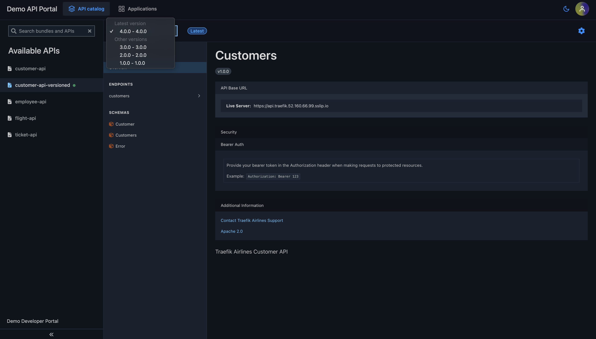
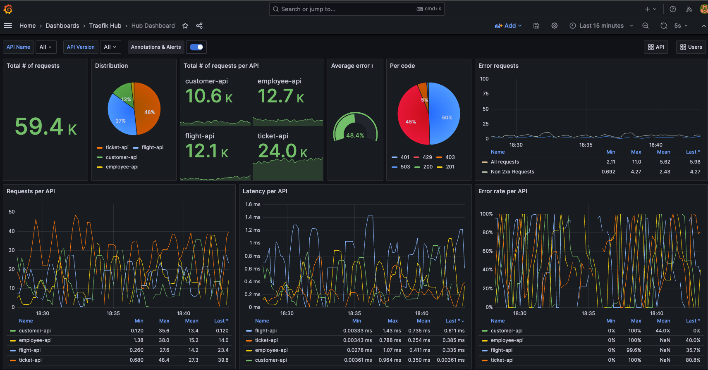

# Advanced API Capabilities

Once an API is defined, managing its access becomes crucial. API Access Management governs API availability. 
It determines who can access the API and which operations can be performed. 
This layer is configured flexibly and composably using the **APIAccess** resource. 
API access management allows organizations to tailor access control policies to their specific requirements.

In this module, we will cover:

- API versioning
- API rate-limit policy 
- Granular API access 
- OTel with Grafana

---

## API versioning

API versioning is crucial for managing changes, updates, and improvements to APIs over time. 
Traefik Hub provides robust support for effectively managing multiple API versions while maintaining backward
compatibility and supporting existing clients.

We have multiple versions of **customer-app** deployed in our cluster. 

```bash
kubectl -n apps get pod | grep customer
```
```
customer-app-5c5bdcf6fc-9s2jx      1/1     Running   0          27h
customer-app-v2-5b47b4d744-wmvbk   1/1     Running   0          27h
customer-app-v3-978988d6b-48bwv    1/1     Running   0          27h
customer-app-v4-5bb9f59bc6-6b6j5   1/1     Running   0          27h
```

We can publish **customer-app** as an API using **_API_** object and have each version of the application attached to it using **_APIVersion_**.
Each version of the application will have its own ingress definition which allows flexibility on how each version of the API is exposed. 

1. Create an **_API_** object 

```yaml
apiVersion: hub.traefik.io/v1alpha1
kind: API
metadata:
  name: customer-api-versioned     # API Name
  namespace: apps
  labels:
    area: customers
    module: crm
spec:
  versions:                         # Attach APIVersion objects
    - name: customer-api-v1         # APIVersion object name 
    - name: customer-api-v2
    - name: customer-api-v3
    - name: customer-api-v4   
```

2. Create **_APIVersion_** object for each version of the application. 

```yaml
apiVersion: hub.traefik.io/v1alpha1
kind: APIVersion                   
metadata:
  name: customer-api-v1            # APIVersion Object Name     
  namespace: apps
spec:
  release: 1.0.0
  openApiSpec:
    path: /openapi.yaml
```

3. Promote **_IngressRoute_** definition to be managed by Hub APIM **_APIVersion_** object.

```yaml
apiVersion: traefik.io/v1alpha1
kind: IngressRoute
metadata:
  name: api-ingress-customers-v1
  namespace: apps
  annotations:                                      
    hub.traefik.io/api: customer-api-versioned      # API Name  
    hub.traefik.io/api-version: customer-api-v1     # APIVersion Object Name
spec:
  entryPoints:
    - websecure
  routes:
    - kind: Rule
      match: Host(`api.traefik.${EXTERNAL_IP}.sslip.io`) && PathPrefix(`/customers`) && Header(`version`, `v1`)
      services:
        - name: customer-app
          port: 3000
  tls:
    certResolver: le
```

> [!IMPORTANT]     
> :pencil2: Deploy **_`api-versioning`_** to the cluster. 

```bash
kubectl apply -f module-4/manifests/api-versioning.yaml
```

Now, you should be able to interact with all versions of the API via API Dev Portal. 


Portal URL:
```bash
echo https://demo-portal.traefik.$(terraform output -raw external_ip).sslip.io
```

<details><summary>Validate API versioning and Plans:</summary>

```bash
export access_token=$(curl -X POST -H 'Content-Type: application/x-www-form-urlencoded' \
https://login.microsoftonline.com/$(terraform output -raw tenant_id)/oauth2/v2.0/token \
-d "client_id=$(terraform output -raw application_client_id)" \
-d "client_secret=$(terraform output -raw application_client_secret)" \
-d "scope=$(terraform output -raw entraid_api_id)/.default" \
-d "grant_type=password" \
-d "username=$(terraform output -raw admin_email)" \
-d "password=$(terraform output -raw admin_password)" | grep -o '"access_token":"[^"]*' | cut -d'"' -f4)
```

```bash
curl -I -H "version: v1" -H "Authorization: Bearer $access_token" https://api.traefik.$(terraform output -raw external_ip).sslip.io/customers
```

</details>
___

## API Plans

API Plans define the rate limits and quotas for API consumers. It serves three primary purposes: protecting infrastructure, managing quotas, and enabling API monetization.

By using the **_APIPlan_** object, you can apply rate limits and quotas to **_APICatalogItem_** and **_ManagedSubscription_** for specific **APIs**.
This helps to prevent API abuse, control traffic, and ensure a stable and predictable user experience. 

```yaml

apiVersion: hub.traefik.io/v1alpha1
kind: APIPlan
metadata:
  name: platinum
  namespace: apps
spec:
  title: "Platinum"
  description: "Platinum rate limits and quotas"
  rateLimit:
    limit: 1000
    period: 10s
  quota:
    limit: 10000
    period: 720h # Approximately 30 days
```

<br/>

> [!IMPORTANT]
> :pencil2: Deploy **_api-rate-limit_** to the cluster.
> Apply the API rate policy manifest file.

<details><summary>Validate API Plans:</summary>

```bash
export access_token=$(curl -X POST -H 'Content-Type: application/x-www-form-urlencoded' \
https://login.microsoftonline.com/$(terraform output -raw tenant_id)/oauth2/v2.0/token \
-d "client_id=$(terraform output -raw application_client_id)" \
-d "client_secret=$(terraform output -raw application_client_secret)" \
-d "scope=$(terraform output -raw entraid_api_id)/.default" \
-d "grant_type=password" \
-d "username=$(terraform output -raw admin_email)" \
-d "password=$(terraform output -raw admin_password)" | grep -o '"access_token":"[^"]*' | cut -d'"' -f4)
```

```bash
curl -I -H "version: v1" -H "Authorization: Bearer $access_token" https://api.traefik.$(terraform output -raw external_ip).sslip.io/customers
```

Observe the `x-quota-remaining` header.

</details>
___

## Granular API access

For more fine-grained control over API exposure, Traefik Hub offers the ability to selectively grant access to a defined set of operations as specified in the API (e.g., Only GET) for a specific group.   

This is done through the use of two definitions:      
1. `operationSets` defines the methods allowed as part of the **API** resource definition.       
2. `operationFilter` references `operationSets` definition as part the **APIAccess** policy. 

Below, we modified the flight API that we deployed in module-3 to only allow the **GET** method. 

```yaml
apiVersion: hub.traefik.io/v1alpha1
kind: API
metadata:
  name: flight-api
  namespace: apps
  labels:
    area: flights
    module: erp
spec:
  openApiSpec:
    path: /openapi.yaml
    operationSets:                   # Add operationSets into the API definition file.
      - name: read-flights           # Provide a name that will be referenced by operationFilter.    
        matchers:                    # Restrict access based on specific criteria. 
          - pathPrefix: "/flight"    # In this example, only "GET" is allowed to "/flights"   
            methods: ["GET"]
```

For the above to take effect, `operationFilter` should be defined as part of the **APIAccess** policy to restrict access to specific groups. 

In the below example, we are restricting the **_support_** user group to only "GET" operation for **_flights_** API only. 

```yaml
apiVersion: hub.traefik.io/v1alpha1
kind: APICatalogItem
metadata:
  name: airline-restricted-platinum
  namespace: apps
spec:
  groups:
    - support
    - admin
  apis:
    - name: flight-api
    - name: ticket-api
  apiPlan:
    name: platinum
  operationFilter:
    include:
      - cru-tickets
      - read-flights
```

<br/>

> [!IMPORTANT]
> :pencil2: Deploy **_`api-granular-access.yaml`_** to the cluster.
> Apply API rate policy manifest file.

```bash
kubectl apply -f module-4/manifests/api-granular-access.yaml
```

<br>

___

## OTel with Grafana

Traefik Hub showcases a wealth of OpenTelemetry metrics and labels that redefine how organizations monitor, manage, and optimize their API infrastructure.

<br/>

> [!IMPORTANT]
> :pencil2: Follow the below steps to deploy the monitoring stack on your AKS cluster.

1. Create a namespace for the monitoring stack.

```bash
kubectl create namespace monitoring
```

2. Deploy the Prometheus and Grafana stack.

```bash
kubectl apply -R -f module-4/monitoring/
```

3. Verify everything is running. 

4. Get the Grafana URL and access the Grafana dashboard (user/password: **admin/admin**)

```bash
kubectl -n monitoring describe ingressroute.traefik.io grafana
```

```
Name:         grafana
Namespace:    monitoring
Labels:       <none>
Annotations:  <none>
API Version:  traefik.io/v1alpha1
Kind:         IngressRoute
Metadata:
  Creation Timestamp:  2024-02-29T19:00:25Z
  Generation:          1
  Resource Version:    2200
  UID:                 f8967e4b-aff8-4b28-97f2-ab4fefd9a18b
Spec:
  Entry Points:
    web
  Routes:
    Kind:   Rule
    Match:  Host(`grafana.${EXTERNAL_IP}.sslip.io`)    # Grafana URL
    Services:
      Name:       grafana
      Namespace:  monitoring
      Port:       3000
Events:           <none>
```

```bash
echo http://grafana.$(terraform output -raw external_ip).sslip.io
```

5. Once logged in to Grafana, navigate to Dashboards > Traefik Hub > Hub Dashboard.



## References

- API rate limit.   
https://doc.traefik.io/traefik-hub/api-management/api-rate-limit

- API granular access.     
https://doc.traefik.io/traefik-hub/api-management/api-access

- Enable OpenTelemetry.  
https://doc.traefik.io/traefik-hub/operations/metrics

- Enhancing API Observability: Traefik Hub, OpenTelemetry, and the New Era of Data-Driven API Management.  
https://traefik.io/blog/opentelemetry-traefik-hub/

------
:house: [HOME](../README.md) 
