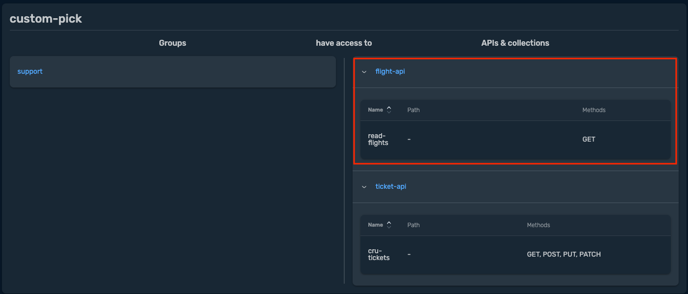

# Advanced API Capabilities

Once an API is defined, managing its access becomes crucial. API Access Management governs API availability. It determines who can access the API and which operations can be performed. This layer is configured flexibly and composably using the APIAccess resource. API access management allows organizations to tailor access control policies to their specific requirements.

In this module, we will cover:

- API rate limit policy 
- Granular API access 
- OTel with Grafana

___
## API Rate Limit Policy

API rate limiting defines consumption limits for API consumers. It serves three primary purposes: protecting infrastructure, managing quotas, and enabling API monetization.

By using the APIRateLimit object, you can apply rate limits to <b> user groups </b> for specific <b>APIs</b>. This helps to prevent API abuse, control traffic, and ensure a stable and predictable user experience. 

Multiple rate limits can be configured using any combination of groups and APIs.

Traefik Hub supports two strategies for rate limiting:
- <b>Local strategy</b>: applies rate limiting policies to a single Traefik Hub API Gateway replica. Each instance manages its own counter. 
- <b>Distributed strategy</b>: shares rate limiting policies across all Traefik Hub API Gateway replicas. This ensures consistency across all instances.

```yaml
apiVersion: hub.traefik.io/v1alpha1
kind: APIRateLimit
metadata:
  name: apim-employees-drl
  namespace: apps
spec:
  apis:
  - name: employee-api
  groups:
  - admin                           # Apply to all users who are part of the admin group
  limit: 5                          # Number of requests allowed (5 requests)    
  period: 30s                       # Over the time period (30s)
  strategy: distributed             # Limit will be enforced across all API Gateway instances.  
```
</br>

> [!IMPORTANT]     
> :pencil2: *Deploy <code><b>api-rate-limit</b></code> to the cluster.* 

> Apply the API rate policy manifest file. 
```bash
kubectl apply -f module-4/manifests/api-rate-limit.yaml
```
```bash
# Verify API rate limit policies.

kubectl -n apps get apiratelimit

NAME                 AGE
apim-employees-drl   14s
apim-fallback-drl    14s
```
</br>


<details><summary><b>Rate Limit Policy - Traefik Hub UI :bulb: </b></summary>

- Rate-limit policies across all clusters are listed under <b>Rate Limits</b> view.

  

- Rate-limit policy details can be obtained by selecting the policy

  

  </details>
    <p>

___

## Granular API access

For more fine-grained control over API exposure, Traefik Hub offers the ability to selectively grant access to a defined set of operations as specified in the API (e.g., Only GET) for a specific group.   

This is done through the use of two definitions:      
1. <code><b>operationSets</b></code> defines the methods allowed as part of the <b>API</b> resource definition.       
2. <code><b>operationFilter</b></code> references <code>operationSets</code> definition as part the <b>APIAccess</b> policy. 
<p>
Below, we modified the flight API that we deployed in module-3 to only allow the <b>GET</b> method. 


```yaml
apiVersion: hub.traefik.io/v1alpha1
kind: API
metadata:
  name: flight-api
  namespace: apps
  labels:
    area: flights
    module: erp
spec:
  openApiSpec:
    path: /openapi.yaml
    operationSets:                   # Add operationSets into the API definition file.
      - name: read-flights           # Provide a name that will be referenced by operationFilter.    
        matchers:                    # Restrict access based on specific criteria. 
          - pathPrefix: "/flight"    # In this example, only "GET" is allowed to "/flights"   
            methods: ["GET"]
```
<p>
For the above to take effect, <code>operationFilter</code> should be defined as part of the <b>APIAccess</b> policy to restrict access to specific groups. 

In the below example, we are restricting the <b>*support*</b> user group to only "GET" operation for <b>*flights*</b> API only. 

```yaml
apiVersion: hub.traefik.io/v1alpha1
kind: APIAccess
metadata:
  name: support-access
  namespace: apps
spec:
  groups:
    - support
  apiSelector:
    matchExpressions:
      - key: area
        operator: In
        values:
          - flights
          - tickets
  operationFilter:                  # Add operationFilter into APIAccess definition file.
    include:
      - read-flights                # Specify the name of the operationSets to include for this group.
      - cru-tickets
      
```

</br>

> [!IMPORTANT]     
> :pencil2: *Deploy <code><b>api-granular-access.yaml</b></code> to the cluster.* 

> Apply API rate policy manifest file. 
```bash
kubectl apply -f module-4/manifests/api-granular-access.yaml
```
<br>

<details><summary><b>Granular Access Policy - Traefik Hub UI :bulb: </b></summary>

- <b>support</b> user has only GET access to flight-api

  

- API Access display allowed methods under the <b>Portal</b> view

  

  </details>
    <p>
___

## OTel with Grafana

Traefik Hub showcases a wealth of OpenTelemetry metrics and labels that redefine how organizations monitor, manage, and optimize their API infrastructure.

</br>

> [!IMPORTANT]     
> :pencil2: *Follow the below steps to deploy the monitoring stack on your AKS cluster.* 


1. Create a namespace for the monitoring stack.

    ```bash
    kubectl create namespace monitoring
    ```
2. Deploy the Prometheus stack.

    ```bash
    kubectl apply -f module-4/monitoring/prometheus/
    ```
3. Deploy the Grafana stack.

    ```bash
    kubectl apply -f module-4/monitoring/grafana
    ```
4. Verify everything is running. 

    ```bash
    kubectl -n monitoring get pods,svc
    NAME                                   READY   STATUS    RESTARTS     AGE
    pod/grafana-5b88f776dd-b5fmk           1/1     Running   0            25h
    pod/prometheus-core-547f84fdd4-5sx55   2/2     Running   1 (8h ago)   8h
    
    NAME                              TYPE        CLUSTER-IP     EXTERNAL-IP   PORT(S)    AGE
    service/prometheus-remote-write   ClusterIP   10.43.158.82   <none>        80/TCP     25h
    service/grafana                   ClusterIP   10.43.40.181   <none>        3000/TCP   25h
    service/prometheus                ClusterIP   10.43.8.73     <none>        9090/TCP   25h
    ```
5. Get the Grafana URL and access the Grafana dashboard (user/password: <b>admin/admin</b>)

    ```bash
    kubectl -n monitoring describe ingressroute.traefik.io grafana

    Name:         grafana
    Namespace:    monitoring
    Labels:       <none>
    Annotations:  <none>
    API Version:  traefik.io/v1alpha1
    Kind:         IngressRoute
    Metadata:
      Creation Timestamp:  2024-02-29T19:00:25Z
      Generation:          1
      Resource Version:    2200
      UID:                 f8967e4b-aff8-4b28-97f2-ab4fefd9a18b
    Spec:
      Entry Points:
        web
      Routes:
        Kind:   Rule
        Match:  Host(`grafana.EXTERNAL_IP.sslip.io`)    # Grafana URL
        Services:
          Name:       grafana
          Namespace:  monitoring
          Port:       3000
    Events:           <none>
    ```
    ```yaml
    http://grafana.{k8s-cluster-external-ip}.sslip.io
    ```

6. Once logged in to Grafana, navigate to Dashboards > Traefik Hub > Hub Dashboard.

    

    <br>

### Generate Traffic:

Now that the observability stack is deployed, let's generate some traffic! 


> [!NOTE]     
> :pencil2: *Follow the below steps to deploy the monitoring stack on your AKS cluster.* 

<br>


1. Create a new namespace to host traffic generator deployment. 

   ```bash
   kubectl create ns traffic
   ```

2. To interact with the APIs, we need to generate API Keys for <b>*admin*</b> and <b>*support*</b> users that we created in module-3. 

    - If you don't have the token saved, log in to <b>API Portal</b> and <b>*Create token*</b>.

      <details><summary><b>Create Token - Traefik Hub UI :bulb: </b></summary>

      

      
      </details>
      <p>

    - Create a <b>Kubernetes Secret</b> containing the tokens to enable the traffic app to generate load

    ```bash
    export ADMIN_TOKEN="xxx"
    export SUPPORT_TOKEN="yyy"
    ```
    ```bash
    kubectl create secret generic tokens -n traffic --from-literal=admin="${ADMIN_TOKEN}" --from-literal=support="${SUPPORT_TOKEN}"
    ```  
3.  Deploy the load generator app. This should start with two instances for each user. 

    ```bash
    kubectl apply -f module-4/traffic/
    ```
    ```bash
    kubectl -n traffic get pod

    NAME                                   READY   STATUS    RESTARTS   AGE
    traffic-app-admin-764cdfdb95-ctgm9     1/1     Running   0          20h
    traffic-app-support-55f77d7fb5-hsdr5   1/1     Running   0          20h
    ```
4. Explore Grafana dashboard! 

## References

- API rate limit.   
https://doc.traefik.io/traefik-hub/api-management/api-rate-limit

- API granular access.     
https://doc.traefik.io/traefik-hub/api-management/api-access

- Enable OpenTelemetry.  
https://doc.traefik.io/traefik-hub/operations/metrics

- Enhancing API Observability: Traefik Hub, OpenTelemetry, and the New Era of Data-Driven API Management.  
https://traefik.io/blog/opentelemetry-traefik-hub/

------
:house: [HOME](../README.md) 
